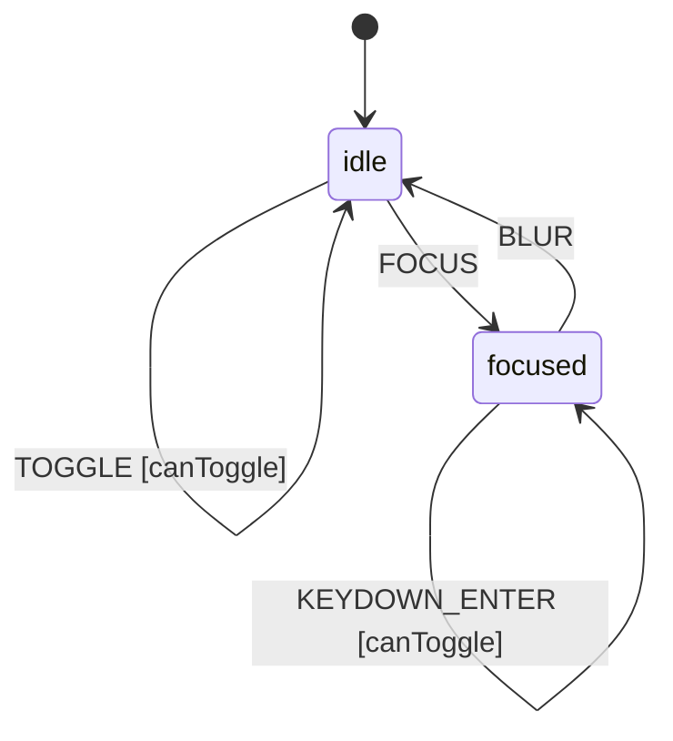

# Switch Component

A binary toggle control for forms and interactive UIs. Provides keyboard 
navigation, focus management, and accessibility attributes.

## Intent

The Switch represents a binary on/off state. Users can toggle it via click,
tap, or keyboard (Space/Enter). The component respects disabled state and
provides visual feedback for focus.

Constraint: A disabled switch cannot be toggled by any means.
Constraint: Toggling must update checked state atomically.
Constraint: Focus state is independent of checked state.

## Context Schema

The extended state (context) that persists across state machine transitions.

```cue
// Context defaults
context: {
    checked:  false
    disabled: false
    readOnly: false
    focused:  false
}
```

## State Machine

The Switch has two primary states based on focus.

```cue
// Machine configuration
machine: {
    id:      "switch"
    initial: "idle"
    
    states: {
        idle: {
            on: {
                FOCUS:  {target: "focused", actions: ["setFocused"]}
                TOGGLE: {target: "idle", actions: ["toggle"], guard: "canToggle"}
            }
        }
        focused: {
            on: {
                BLUR:          {target: "idle", actions: ["clearFocused"]}
                TOGGLE:        {target: "focused", actions: ["toggle"], guard: "canToggle"}
                KEYDOWN_SPACE: {target: "focused", actions: ["toggle"], guard: "canToggle"}
                KEYDOWN_ENTER: {target: "focused", actions: ["toggle"], guard: "canToggle"}
            }
        }
    }
}
```

## Guards

Guards are predicates that must return true for a transition to proceed.

```cue
guards: {
    canToggle: "!context.disabled && !context.readOnly"
}
```

## Actions

Actions mutate context or trigger side effects.

```cue
actions: {
    toggle: {
        description: "Invert the checked state"
        mutation:    "context.checked = !context.checked"
        emits:       ["onCheckedChange"]
    }
    setFocused: {
        mutation: "context.focused = true"
    }
    clearFocused: {
        mutation: "context.focused = false"
    }
}
```

## Events Emitted

```cue
events: {
    onCheckedChange: {
        description: "Fired when checked state changes"
        payload: ["checked", "previousChecked"]
    }
}
```

## Invariants

These must ALWAYS hold true. Use for property-based testing.

```cue
invariants: [
    "typeof context.checked === 'boolean'",
    "context.disabled implies no state transitions occur",
]
```

## Accessibility

- Role: `switch`
- ARIA: `aria-checked` reflects `context.checked`
- Keyboard: Space and Enter toggle when focused

## State Diagram


