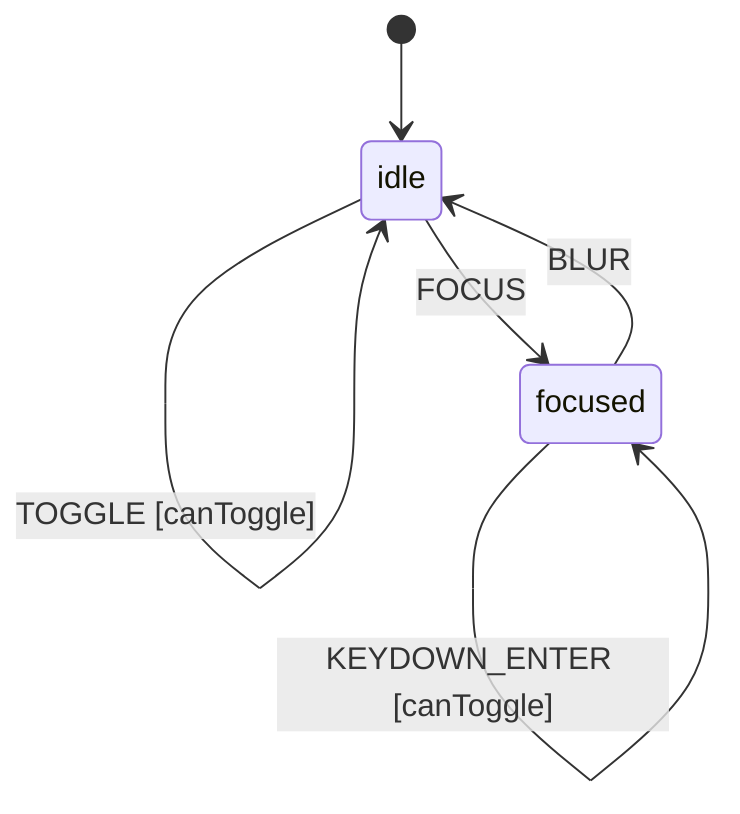

# Switch Component

A binary toggle control for forms and interactive UIs. Provides keyboard 
navigation, focus management, and accessibility attributes.

## Requirements

```sudolang
The switch represents a binary on/off control.
Users can toggle via click, touch, or keyboard.

Constraints:
  - Disabled switches cannot be toggled by any means
  - Read-only switches display state but cannot be changed
  - Toggling must update checked state atomically
  - Focus state is independent of checked state

Keyboard Interaction:
  - Tab: Focus/unfocus the switch
  - Space: Toggle when focused
  - Enter: Toggle when focused

Error Handling:
  - If toggle fails, state must remain unchanged
  - Screen readers announce state changes
```

## Design Guidelines

```sudolang
Visual Design:
  Touch target: minimum 44x44px (iOS/WCAG), 48dp (Android)
  Transition: 200ms ease-out for state changes
  Color contrast: WCAG AA minimum (4.5:1)
  Handle: Circular, white, subtle shadow

Responsive Behavior:
  Mobile (<640px):
    - Full-width in form contexts
    - Increased touch target (56px)
    - Haptic feedback on toggle (if available)
  Tablet (640-1024px):
    - Inline with form labels
    - Standard touch target (48px)
  Desktop (>1024px):
    - Compact sizing allowed (24px height)
    - Hover states visible

Usage Guidance:
  USE Switch for:
    - Binary settings (on/off, enabled/disabled)
    - Immediate effect changes (no submit required)
    - User preferences and toggles
  
  DO NOT USE Switch for:
    - Multiple options → use Radio or Select
    - Actions → use Button
    - Consent/agreement forms → use Checkbox
    - Required form fields → use Checkbox

Visual States:
  Default: Neutral gray track, handle left
  Checked: Accent color track, handle right
  Focused: Focus ring (2px offset)
  Disabled: 50% opacity, cursor not-allowed
  Loading: Indeterminate animation (optional)
  Error: Red border if validation context requires
```

## Component API

```typescript
interface SwitchProps {
  /** Current checked state */
  checked?: boolean;  // default: false
  
  /** Prevents interaction when true */
  disabled?: boolean;  // default: false
  
  /** Called when checked state changes */
  onCheckedChange?: (checked: boolean) => void;
}
```

## Formal Model

```quint
// Switch Component Formal Model
// Extracted at build time for verification
module switch {
  var checked: bool
  var disabled: bool
  var readOnly: bool
  var focused: bool
  var state: str  // "idle" | "focused"
  var _action: str  // Tracks action name for ITF traces

  action init = all {
    checked' = false,
    disabled' = false,
    readOnly' = false,
    focused' = false,
    state' = "idle",
    _action' = "init"
  }

  action toggle = all {
    not(disabled),
    not(readOnly),
    checked' = not(checked),
    disabled' = disabled,
    readOnly' = readOnly,
    focused' = focused,
    state' = state,
    _action' = "TOGGLE"
  }

  action focus = all {
    state' = "focused",
    focused' = true,
    checked' = checked,
    disabled' = disabled,
    readOnly' = readOnly,
    _action' = "FOCUS"
  }

  action blur = all {
    state' = "idle",
    focused' = false,
    checked' = checked,
    disabled' = disabled,
    readOnly' = readOnly,
    _action' = "BLUR"
  }

  action step = any {
    toggle,
    focus,
    blur
  }

  // Invariants
  val disabled_blocks_toggle = disabled implies (checked == checked)
  val readonly_blocks_toggle = readOnly implies (checked == checked)
  val valid_state = state == "idle" or state == "focused"
  val checked_is_boolean = checked == true or checked == false
}
```

## Test Vectors

```test-vectors
# Curated edge cases for parity testing
# Format: scenario | given | when | then

- scenario: "toggle from idle unchecked"
  given:
    context: { checked: false, disabled: false, readOnly: false, focused: false }
    state: "idle"
  when: TOGGLE
  then:
    context: { checked: true, disabled: false, readOnly: false, focused: false }
    state: "idle"

- scenario: "toggle from idle checked"
  given:
    context: { checked: true, disabled: false, readOnly: false, focused: false }
    state: "idle"
  when: TOGGLE
  then:
    context: { checked: false, disabled: false, readOnly: false, focused: false }
    state: "idle"

- scenario: "disabled switch ignores toggle"
  given:
    context: { checked: false, disabled: true, readOnly: false, focused: false }
    state: "idle"
  when: TOGGLE
  then:
    context: { checked: false, disabled: true, readOnly: false, focused: false }
    state: "idle"

- scenario: "readOnly switch ignores toggle"
  given:
    context: { checked: true, disabled: false, readOnly: true, focused: false }
    state: "idle"
  when: TOGGLE
  then:
    context: { checked: true, disabled: false, readOnly: true, focused: false }
    state: "idle"

- scenario: "focus from idle"
  given:
    context: { checked: false, disabled: false, readOnly: false, focused: false }
    state: "idle"
  when: FOCUS
  then:
    context: { checked: false, disabled: false, readOnly: false, focused: true }
    state: "focused"

- scenario: "blur from focused"
  given:
    context: { checked: false, disabled: false, readOnly: false, focused: true }
    state: "focused"
  when: BLUR
  then:
    context: { checked: false, disabled: false, readOnly: false, focused: false }
    state: "idle"

- scenario: "toggle while focused"
  given:
    context: { checked: false, disabled: false, readOnly: false, focused: true }
    state: "focused"
  when: TOGGLE
  then:
    context: { checked: true, disabled: false, readOnly: false, focused: true }
    state: "focused"
```

## Context Schema

```cue
context: {
    checked:  false
    disabled: false
    readOnly: false
    focused:  false
}
```

## State Machine

```cue
machine: {
    id:      "switch"
    initial: "idle"
    
    states: {
        idle: {
            on: {
                FOCUS:  {target: "focused", actions: ["setFocused"]}
                TOGGLE: {target: "idle", actions: ["toggle"], guard: "canToggle"}
            }
        }
        focused: {
            on: {
                BLUR:          {target: "idle", actions: ["clearFocused"]}
                TOGGLE:        {target: "focused", actions: ["toggle"], guard: "canToggle"}
                KEYDOWN_SPACE: {target: "focused", actions: ["toggle"], guard: "canToggle"}
                KEYDOWN_ENTER: {target: "focused", actions: ["toggle"], guard: "canToggle"}
            }
        }
    }
}
```

## Guards

```cue
guards: {
    canToggle: "!context.disabled && !context.readOnly"
}
```

## Actions

```cue
actions: {
    toggle: {
        description: "Invert the checked state"
        mutation:    "context.checked = !context.checked"
        emits:       ["onCheckedChange"]
    }
    setFocused: {
        mutation: "context.focused = true"
    }
    clearFocused: {
        mutation: "context.focused = false"
    }
}
```

## Events Emitted

```cue
events: {
    onCheckedChange: {
        description: "Fired when checked state changes"
        payload: ["checked", "previousChecked"]
    }
}
```

## Accessibility

```sudolang
Role: switch
ARIA attributes:
  - aria-checked: reflects context.checked
  - aria-disabled: reflects context.disabled (if disabled)
  - aria-readonly: reflects context.readOnly (if readOnly)

Focus Management:
  - Must be focusable via Tab when not disabled
  - Focus ring visible on keyboard focus
  - Focus trap not needed (single control)

Screen Reader:
  - Announce role and current state
  - Announce state changes
  - Provide accessible name via label or aria-label
```

## ARIA Mapping

```aria-mapping
| State   | aria-checked | aria-disabled |
|---------|--------------|---------------|
| idle    | {checked}    | {disabled}    |
| focused | {checked}    | {disabled}    |
```

## State Diagram



---

## Example Usages

```tsx example="basic"
<Switch onChange={(on) => console.log(on)}>
  Dark Mode
</Switch>
```

```tsx example="checked"
<Switch checked>
  Enabled Feature
</Switch>
```

```tsx example="disabled"
<Switch disabled>
  Locked Setting
</Switch>
```
