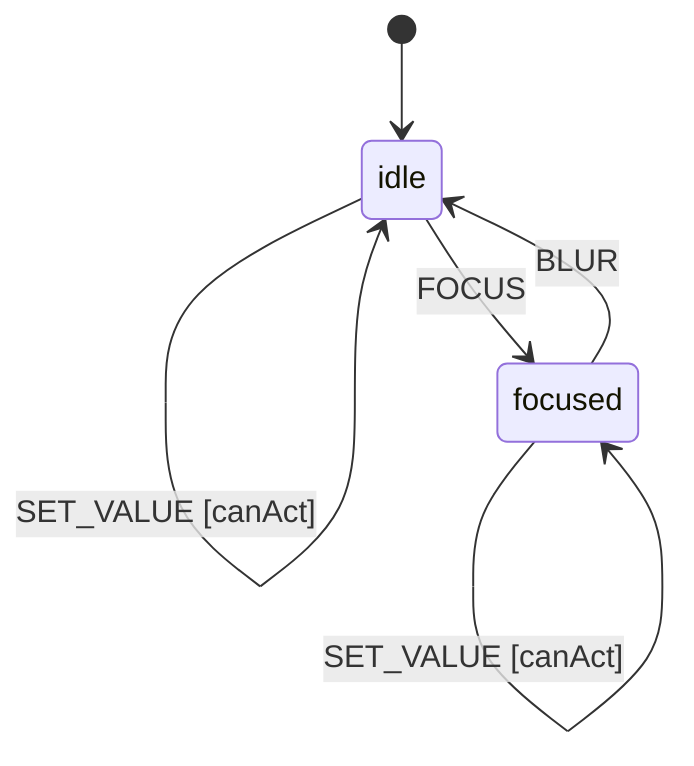

# Component Spec Template

This template demonstrates the required structure for Rubigo component specifications.
Copy this file when creating a new component and replace the example content.

> **Note:** This template itself is a valid spec that passes `just build` validation.

## Spec Types

| Type | Description | Required Sections |
|------|-------------|-------------------|
| `primitive` | Full statechart + Quint model (default) | Context, Machine, Guards, Actions |
| `compound` | Composes primitives, may have orchestration state | Composition, Context |
| `presentational` | Styling only, no state machine | Design Guidelines |
| `schema` | Data types only, no UI | Context Schema |

**Forbidden for presentational/schema:** State Machine, Guards, Actions, Formal Model, Test Vectors


## Language References

| Language | Purpose | Reference |
|----------|---------|-----------|
| Sudolang | Human intent, requirements, accessibility | `references/sudolang-v2.0.md` |
| Quint | Formal verification, invariants | `references/quint-lang.md` |
| CUE | Runtime config, type constraints | `references/cuelang-v0.15.1.md` |

---

## Requirements

Use Sudolang for human-readable requirements, constraints, and accessibility.

```sudolang
// TEMPLATE: Replace with your component's requirements

The component provides [primary function].
Users interact via [input methods].

Constraints:
  - Disabled state blocks all user interactions
  - State changes are atomic
  - Invalid states are unreachable

Keyboard Interaction:
  - Tab: Focus/unfocus
  - Space/Enter: Primary action

Error Handling:
  - Failed actions leave state unchanged
  - Screen readers announce errors
```

---

## Design Guidelines

Optional section for visual design, responsive behavior, and usage guidance.

```sudolang
// TEMPLATE: Replace with your component's design guidelines

Visual Design:
  Touch target: minimum 44x44px
  Transition: 200ms ease-out
  Color contrast: WCAG AA minimum

Responsive Behavior:
  Mobile: Full-width, larger touch targets
  Desktop: Compact sizing, hover states

Usage Guidance:
  USE for: [appropriate use cases]
  DO NOT USE for: [inappropriate use cases]
```

---

## Formal Model

Use Quint for verifiable behavior specification and invariants.

```quint
// TEMPLATE: Replace with your component's formal model
module template {
  // State variables
  var enabled: bool
  var value: str
  var _state: str   // REQUIRED: Tracks state machine state for ITF traces
  var _action: str  // REQUIRED: Tracks action name for ITF traces

  // Initialize
  action init = all {
    enabled' = true,
    value' = "",
    _state' = "idle",
    _action' = "init"
  }

  // Primary action
  action setValue(v: str) = all {
    enabled,
    value' = v,
    enabled' = enabled,
    _state' = _state,
    _action' = "SET_VALUE"  // Use SCREAMING_SNAKE_CASE matching CUE events
  }

  // Step action for simulation (excludes init - that's for initialization only)
  action step = any {
    setValue("")
    // Add all your actions here for quint run to explore
  }

  // Invariants (properties that must always hold)
  val enabled_is_boolean = enabled == true or enabled == false
  val value_is_string = value == value
}
```

---

## Test Vectors

Test vectors validate interpreter implementations. Format: scenario/given/when/then.

```test-vectors
# TEMPLATE: Replace with your component's test vectors

- scenario: "basic action"
  given:
    context: { enabled: true, value: "" }
    state: "idle"
  when: SET_VALUE
  then:
    context: { enabled: true, value: "new" }
    state: "idle"

- scenario: "disabled blocks action"
  given:
    context: { enabled: false, value: "" }
    state: "idle"
  when: SET_VALUE
  then:
    context: { enabled: false, value: "" }
    state: "idle"
```

---

## Context Schema

Define the runtime context variables. Use CUE syntax.

```cue
// TEMPLATE: Replace with your component's context
// CUE syntax: no quotes on keys, no commas, uses colons
context: {
    enabled: true    // Whether interactions are allowed
    value:   ""      // Current value
}
```

---

## State Machine

Define states and transitions. Use CUE syntax.

```cue
// TEMPLATE: Replace with your component's state machine
machine: {
    id:      "template"
    initial: "idle"
    
    states: {
        idle: {
            on: {
                SET_VALUE: {target: "idle", actions: ["setValue"], guard: "canAct"}
                FOCUS:     {target: "focused", actions: ["setFocused"]}
            }
        }
        focused: {
            on: {
                BLUR:      {target: "idle", actions: ["clearFocused"]}
                SET_VALUE: {target: "focused", actions: ["setValue"], guard: "canAct"}
            }
        }
    }
}
```

---

## Guards

Define conditions that must be true for transitions. Use CUE syntax.

```cue
// TEMPLATE: Replace with your component's guards
// Guards are string expressions evaluated against context
guards: {
    canAct: "context.enabled"
}
```

---

## Actions

Define mutations and emitted events. Use CUE syntax.

```cue
// TEMPLATE: Replace with your component's actions
// Each action has a description and mutation expression
actions: {
    setValue: {
        description: "Update the value"
        mutation:    "context.value = event.payload.value"
        emits:       ["onValueChange"]
    }
    setFocused: {
        mutation: "context.focused = true"
    }
    clearFocused: {
        mutation: "context.focused = false"
    }
}
```

---

## Accessibility

Optional but recommended. Use Sudolang for accessibility requirements.

```sudolang
// TEMPLATE: Replace with your component's accessibility

Role: [appropriate ARIA role]
ARIA attributes:
  - aria-disabled: reflects context.enabled
  - aria-label: descriptive label

Focus Management:
  - Must be focusable via Tab when enabled
  - Focus ring visible on keyboard focus

Screen Reader:
  - Announce role and state
  - Announce state changes
```

---

## State Diagram

Optional Mermaid diagram for visual documentation.


