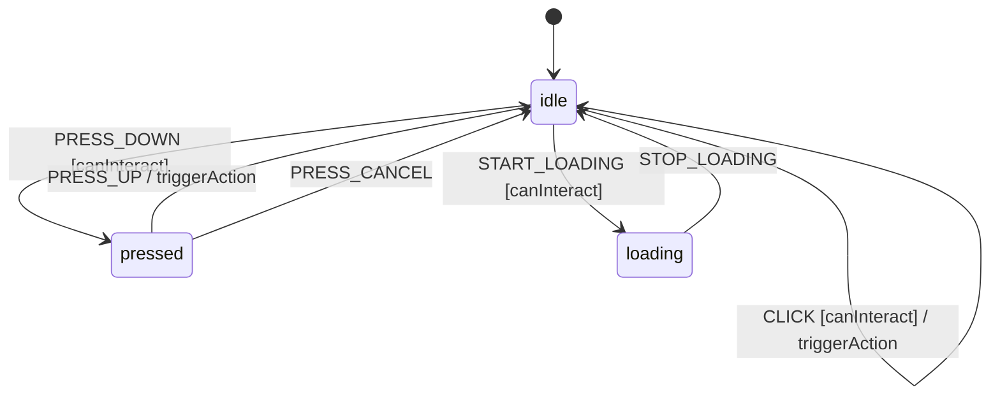

# Button

A button enables users to trigger actions. It supports loading states for async operations,
disabled states to prevent interaction, and pressed states for toggle-button behavior.

## Language References

| Language | Purpose | Reference |
|----------|---------|-----------| 
| Sudolang | Human intent, requirements, accessibility | `references/sudolang-v2.0.md` |
| Quint | Formal verification, invariants | `references/quint-lang.md` |
| CUE | Runtime config, type constraints | `references/cuelang-v0.15.1.md` |

---

## Requirements

```sudolang
// Button Component Requirements

The button triggers actions when activated by click, touch, or keyboard.
It communicates current state via visual cues and ARIA attributes.

States:
  - idle: Default interactive state
  - pressed: Active/down state during click
  - loading: Async operation in progress
  
Constraints:
  - Disabled button blocks ALL interactions (click, keyboard, focus)
  - Loading state automatically disables further activation
  - Press must complete (press down + release) to trigger action
  - State changes are atomic and predictable

Keyboard Interaction:
  - Tab: Focus/unfocus the button
  - Space: Activate on key up (with pressed visual on key down)
  - Enter: Activate immediately (no pressed state)

Error Handling:
  - Failed async operations should exit loading state
  - Screen readers announce state changes
```

---

## Design Guidelines

```sudolang
// Visual Design Guidelines

Visual Variants (styling concern, not state machine):
  primary, secondary, outline, ghost, destructive, link
  
Size Variants:
  sm, default, lg, icon

Visual States:
  Normal: Base appearance
  Hover: Slight background shift
  Focused: Visible focus ring (2px outline)
  Pressed: Darker background, slight scale/inset
  Loading: Spinner overlay, reduced opacity
  Disabled: 50% opacity, not-allowed cursor

Touch Targets:
  Minimum 44x44px for touch accessibility
  
Transition:
  All state changes: 150ms ease-out
```

---

## Formal Model

```quint
module button {
  // State variables
  var disabled: bool
  var loading: bool
  var pressed: bool
  var _action: str  // Tracks action name for ITF traces
  
  // Initialize
  action init = all {
    disabled' = false,
    loading' = false,
    pressed' = false,
    _action' = "init"
  }
  
  // Press down (mouse down or space key down)
  action pressDown = all {
    not(disabled),
    not(loading),
    pressed' = true,
    disabled' = disabled,
    loading' = loading,
    _action' = "PRESS_DOWN"
  }
  
  // Press up (mouse up or space key up) - triggers action
  action pressUp = all {
    pressed,
    pressed' = false,
    disabled' = disabled,
    loading' = loading,
    _action' = "PRESS_UP"
  }
  
  // Cancel press (mouse leaves while pressed)
  action cancelPress = all {
    pressed' = false,
    disabled' = disabled,
    loading' = loading,
    _action' = "CANCEL_PRESS"
  }
  
  // Start loading (async operation)
  action startLoading = all {
    not(disabled),
    loading' = true,
    pressed' = false,
    disabled' = disabled,
    _action' = "START_LOADING"
  }
  
  // Stop loading (async complete)
  action stopLoading = all {
    loading' = false,
    disabled' = disabled,
    pressed' = pressed,
    _action' = "STOP_LOADING"
  }
  
  // Step action for simulation (excludes init - that's for initialization only)
  action step = any {
    pressDown,
    pressUp,
    cancelPress,
    startLoading,
    stopLoading
  }
  
  // Invariants
  val pressed_is_boolean = pressed == true or pressed == false
  val loading_is_boolean = loading == true or loading == false
  val disabled_is_boolean = disabled == true or disabled == false
}
```

---

## Test Vectors

```test-vectors
# Button conformance test scenarios

- scenario: "click triggers action"
  given:
    context: { disabled: false, loading: false, pressed: false }
    state: "idle"
  when: CLICK
  then:
    context: { disabled: false, loading: false, pressed: false }
    state: "idle"

- scenario: "disabled blocks click"
  given:
    context: { disabled: true, loading: false, pressed: false }
    state: "idle"
  when: CLICK
  then:
    context: { disabled: true, loading: false, pressed: false }
    state: "idle"

- scenario: "press down shows pressed"
  given:
    context: { disabled: false, loading: false, pressed: false }
    state: "idle"
  when: PRESS_DOWN
  then:
    context: { disabled: false, loading: false, pressed: true }
    state: "pressed"

- scenario: "press up clears pressed"
  given:
    context: { disabled: false, loading: false, pressed: true }
    state: "pressed"
  when: PRESS_UP
  then:
    context: { disabled: false, loading: false, pressed: false }
    state: "idle"

- scenario: "loading blocks press"
  given:
    context: { disabled: false, loading: true, pressed: false }
    state: "loading"
  when: PRESS_DOWN
  then:
    context: { disabled: false, loading: true, pressed: false }
    state: "loading"

- scenario: "start loading"
  given:
    context: { disabled: false, loading: false, pressed: false }
    state: "idle"
  when: START_LOADING
  then:
    context: { disabled: false, loading: true, pressed: false }
    state: "loading"

- scenario: "stop loading returns to idle"
  given:
    context: { disabled: false, loading: true, pressed: false }
    state: "loading"
  when: STOP_LOADING
  then:
    context: { disabled: false, loading: false, pressed: false }
    state: "idle"
```

---

## Context Schema

```cue
context: {
    disabled: false   // Whether button is disabled
    loading:  false   // Whether async operation is in progress
    pressed:  false   // Whether button is currently pressed down
}
```

---

## State Machine

```cue
machine: {
    id:      "button"
    initial: "idle"
    
    states: {
        idle: {
            on: {
                CLICK:         {target: "idle", actions: ["triggerAction"], guard: "canInteract"}
                PRESS_DOWN:    {target: "pressed", actions: ["setPressedTrue"], guard: "canInteract"}
                START_LOADING: {target: "loading", actions: ["setLoadingTrue"], guard: "canInteract"}
                FOCUS:         {target: "idle", actions: ["setFocused"]}
                BLUR:          {target: "idle", actions: ["clearFocused"]}
            }
        }
        pressed: {
            on: {
                PRESS_UP:      {target: "idle", actions: ["setPressedFalse", "triggerAction"]}
                PRESS_CANCEL:  {target: "idle", actions: ["setPressedFalse"]}
            }
        }
        loading: {
            on: {
                STOP_LOADING:  {target: "idle", actions: ["setLoadingFalse"]}
            }
        }
    }
}
```

---

## Guards

```cue
guards: {
    canInteract: "!context.disabled && !context.loading"
}
```

---

## Actions

```cue
actions: {
    triggerAction: {
        description: "Emit click/activation event"
        mutation:    ""
        emits:       ["onClick"]
    }
    setPressedTrue: {
        description: "Set pressed state to true"
        mutation:    "context.pressed = true"
    }
    setPressedFalse: {
        description: "Set pressed state to false"
        mutation:    "context.pressed = false"
    }
    setLoadingTrue: {
        description: "Start loading state"
        mutation:    "context.loading = true; context.pressed = false"
    }
    setLoadingFalse: {
        description: "End loading state"
        mutation:    "context.loading = false"
    }
    setFocused: {
        mutation: "context.focused = true"
    }
    clearFocused: {
        mutation: "context.focused = false"
    }
}
```

---

## Accessibility

```sudolang
// Button Accessibility Requirements

Role: button (native <button> element preferred)

ARIA Attributes:
  - aria-disabled: Reflects context.disabled
  - aria-busy: Reflects context.loading  
  - aria-pressed: For toggle buttons only (not standard buttons)

Focus Management:
  - Focusable via Tab when enabled (!disabled)
  - Not focusable when disabled (no tabindex or tabindex="-1")
  - Focus ring visible on keyboard focus

Screen Reader:
  - Announce button label and role
  - Announce "disabled" when disabled
  - Announce "loading" or "busy" during async operations
```

---

## State Diagram


