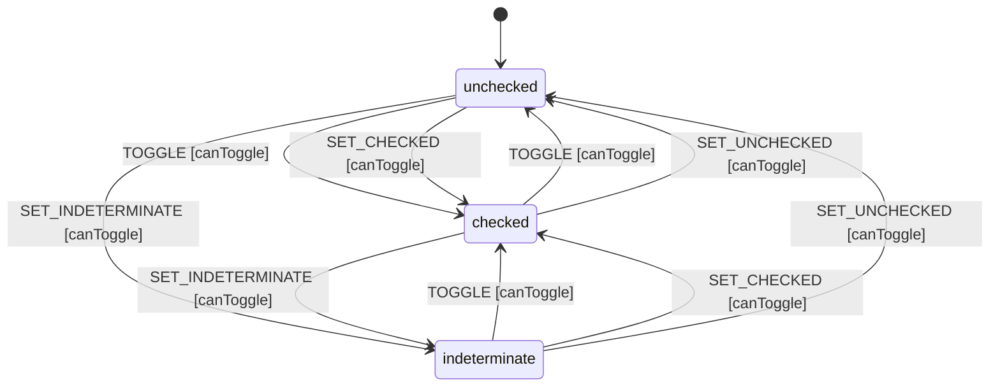

# Checkbox

A primitive checkbox component that supports three states: unchecked, checked, and indeterminate.

## Requirements

```sudolang
The checkbox enables binary or tri-state selection.
Users toggle via click, touch, or keyboard.

Constraints:
  - Disabled checkboxes cannot be toggled
  - Toggle cycles: unchecked → checked, checked → unchecked
  - Indeterminate is set programmatically (not via toggle)
  - State changes emit onChange event

Keyboard Interaction:
  - Tab: Focus/unfocus
  - Space: Toggle when focused
  - Enter: Toggle when focused (optional)

Visual States:
  Unchecked: Empty box
  Checked: Box with checkmark
  Indeterminate: Box with horizontal dash
  Disabled: 50% opacity, cursor not-allowed
```

## Design Guidelines

```sudolang
Visual Design:
  Touch target: minimum 44x44px (24px visible box)
  Transition: 150ms ease-out for state changes
  Color contrast: WCAG AA minimum

Responsive Behavior:
  Mobile: Larger touch targets (56px)
  Desktop: Standard sizing (24px box)

Usage Guidance:
  USE Checkbox for:
    - Multiple selections from a list
    - Consent/agreement forms
    - Feature toggles in settings
  
  DO NOT USE Checkbox for:
    - Binary on/off (use Switch)
    - Single selection (use Radio)
    - Actions (use Button)
```

## Component API

```typescript
interface CheckboxProps {
  /** Current checked state */
  checked?: boolean;  // default: false
  
  /** Prevents interaction when true */
  disabled?: boolean;  // default: false
  
  /** Indeterminate state (neither checked nor unchecked) */
  indeterminate?: boolean;  // default: false
  
  /** Called when checked state changes */
  onChange?: (checked: boolean) => void;
  
  /** Checkbox label content */
  children?: Slot;
}
```

## Formal Model

```quint
module checkbox {
  var checked: bool
  var disabled: bool
  var indeterminate: bool
  var state: str  // "unchecked" | "checked" | "indeterminate"
  var _action: str  // Tracks action name for ITF traces

  action init = all {
    checked' = false,
    disabled' = false,
    indeterminate' = false,
    state' = "unchecked",
    _action' = "init"
  }

  action toggle = all {
    not(disabled),
    state' = if (state == "checked") "unchecked" else "checked",
    checked' = if (state == "checked") false else true,
    indeterminate' = false,
    disabled' = disabled,
    _action' = "TOGGLE"
  }

  action setChecked = all {
    not(disabled),
    state' = "checked",
    checked' = true,
    indeterminate' = false,
    disabled' = disabled,
    _action' = "SET_CHECKED"
  }

  action setUnchecked = all {
    not(disabled),
    state' = "unchecked",
    checked' = false,
    indeterminate' = false,
    disabled' = disabled,
    _action' = "SET_UNCHECKED"
  }

  action setIndeterminate = all {
    not(disabled),
    state' = "indeterminate",
    indeterminate' = true,
    checked' = checked,
    disabled' = disabled,
    _action' = "SET_INDETERMINATE"
  }

  // Step action for simulation (excludes init - that's for initialization only)
  action step = any {
    toggle,
    setChecked,
    setUnchecked,
    setIndeterminate
  }

  // Invariants
  val disabled_is_boolean = disabled == true or disabled == false
  val state_is_valid = state == "unchecked" or state == "checked" or state == "indeterminate"
}
```

## Test Vectors

```test-vectors
# Checkbox test vectors for parity testing
# Format: scenario | given | when | then

- scenario: "toggle from unchecked"
  given:
    context: { checked: false, disabled: false, indeterminate: false }
    state: "unchecked"
  when: TOGGLE
  then:
    context: { checked: true, disabled: false, indeterminate: false }
    state: "checked"

- scenario: "toggle from checked"
  given:
    context: { checked: true, disabled: false, indeterminate: false }
    state: "checked"
  when: TOGGLE
  then:
    context: { checked: false, disabled: false, indeterminate: false }
    state: "unchecked"

- scenario: "toggle from indeterminate"
  given:
    context: { checked: false, disabled: false, indeterminate: true }
    state: "indeterminate"
  when: TOGGLE
  then:
    context: { checked: true, disabled: false, indeterminate: false }
    state: "checked"

- scenario: "disabled blocks toggle"
  given:
    context: { checked: false, disabled: true, indeterminate: false }
    state: "unchecked"
  when: TOGGLE
  then:
    context: { checked: false, disabled: true, indeterminate: false }
    state: "unchecked"

- scenario: "set indeterminate"
  given:
    context: { checked: false, disabled: false, indeterminate: false }
    state: "unchecked"
  when: SET_INDETERMINATE
  then:
    context: { checked: false, disabled: false, indeterminate: true }
    state: "indeterminate"

- scenario: "set checked from indeterminate"
  given:
    context: { checked: false, disabled: false, indeterminate: true }
    state: "indeterminate"
  when: SET_CHECKED
  then:
    context: { checked: true, disabled: false, indeterminate: false }
    state: "checked"
```

## Context Schema

```cue
context: {
    checked:       false   // Current checked state
    disabled:      false   // If true, all interactions blocked
    indeterminate: false   // Tri-state visual (neither checked nor unchecked)
}
```

## State Machine

```cue
machine: {
    id:      "checkbox"
    initial: "unchecked"
    
    states: {
        unchecked: {
            on: {
                TOGGLE:            {target: "checked", actions: ["setChecked"], guard: "canToggle"}
                SET_CHECKED:       {target: "checked", actions: ["setChecked"], guard: "canToggle"}
                SET_INDETERMINATE: {target: "indeterminate", actions: ["setIndeterminate"], guard: "canToggle"}
            }
        }
        checked: {
            on: {
                TOGGLE:            {target: "unchecked", actions: ["setUnchecked"], guard: "canToggle"}
                SET_UNCHECKED:     {target: "unchecked", actions: ["setUnchecked"], guard: "canToggle"}
                SET_INDETERMINATE: {target: "indeterminate", actions: ["setIndeterminate"], guard: "canToggle"}
            }
        }
        indeterminate: {
            on: {
                TOGGLE:        {target: "checked", actions: ["setChecked"], guard: "canToggle"}
                SET_CHECKED:   {target: "checked", actions: ["setChecked"], guard: "canToggle"}
                SET_UNCHECKED: {target: "unchecked", actions: ["setUnchecked"], guard: "canToggle"}
            }
        }
    }
}
```

## Guards

```cue
guards: {
    canToggle: "!context.disabled"
}
```

## Actions

```cue
actions: {
    setChecked: {
        description: "Set to checked state"
        mutation:    "context.checked = true; context.indeterminate?: bool | default: false"
        emits:       ["onChange"]
    }
    setUnchecked: {
        description: "Set to unchecked state"
        mutation:    "context.checked?: bool | default: false; context.indeterminate?: bool | default: false"
        emits:       ["onChange"]
    }
    setIndeterminate: {
        description: "Set to indeterminate visual state"
        mutation:    "context.indeterminate = true"
        emits:       ["onChange"]
    }
}
```

## Accessibility

```sudolang
Role: checkbox
ARIA attributes:
  - aria-checked: "true" | "false" | "mixed" (for indeterminate)
  - aria-disabled: reflects context.disabled

Focus Management:
  - Must be focusable via Tab when not disabled
  - Focus ring visible on keyboard focus

Screen Reader:
  - Announce role and current state
  - Announce state changes
  - Announce "partially checked" for indeterminate
```

## State Diagram


