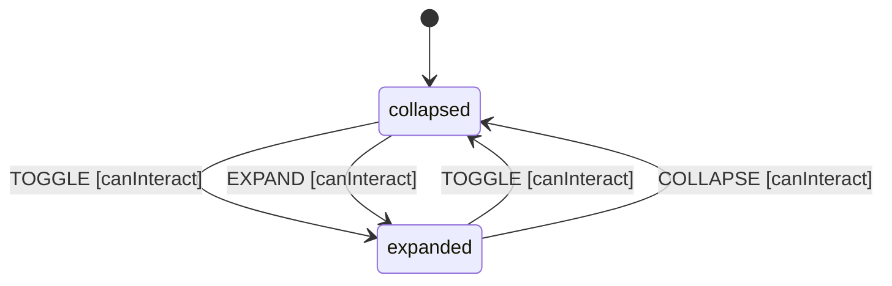

# Collapsible

A Collapsible is a panel that can be expanded or collapsed to show or hide content. Used for progressive disclosure, FAQs, and sidebar sections.

## Language References

| Language | Purpose | Reference |
|----------|---------|-----------|
| Sudolang | Human intent, requirements, accessibility | `references/sudolang-v2.0.md` |
| Quint | Formal verification, invariants | `references/quint-lang.md` |
| CUE | Runtime config, type constraints | `references/cuelang-v0.15.1.md` |

---

## Requirements

```sudolang
// Collapsible provides progressive disclosure of content.
// Users can expand/collapse to show/hide associated content.

Users interact via:
  - Click/tap on trigger element
  - Keyboard: Space/Enter when trigger is focused

Constraints:
  - One trigger controls one content panel
  - Disabled state blocks all interactions
  - Animation should be smooth (150-300ms)
  - Content height animates from 0 to auto

Keyboard Interaction:
  - Space/Enter: Toggle open state when trigger focused

Screen Reader:
  - Trigger has aria-expanded reflecting state
  - Content has aria-hidden when collapsed
```

---

## Design Guidelines

```sudolang
// Visual Design Guidelines

Trigger Appearance:
  - Clear visual indicator of expand/collapse state
  - Chevron or plus/minus icon (rotates on expand)
  - Full-width clickable area for easy targeting

Animation:
  - Expand: 200ms ease-out, height 0 → auto
  - Collapse: 150ms ease-in, height auto → 0
  - Avoid layout shift during animation

States:
  Collapsed: Content hidden, trigger shows "expand" indicator
  Expanded: Content visible, trigger shows "collapse" indicator
  Disabled: 50% opacity, not-allowed cursor

Touch Targets:
  Minimum 44x44px for trigger element
```

---

## Formal Model

```quint
module collapsible {
  // State variables
  var open: bool          // Whether content is expanded
  var disabled: bool      // Whether interaction is blocked
  var state: str          // "collapsed" | "expanded"
  var _action: str        // Tracks action name for ITF traces
  
  // Initialize (collapsed)
  action init = all {
    open' = false,
    disabled' = false,
    state' = "collapsed",
    _action' = "init"
  }
  
  // Toggle open state
  action toggle = all {
    not(disabled),
    open' = not(open),
    disabled' = disabled,
    state' = if (not(open)) "expanded" else "collapsed",
    _action' = "TOGGLE"
  }
  
  // Expand content
  action expand = all {
    not(disabled),
    not(open),
    open' = true,
    disabled' = disabled,
    state' = "expanded",
    _action' = "EXPAND"
  }
  
  // Collapse content
  action collapse = all {
    not(disabled),
    open,
    open' = false,
    disabled' = disabled,
    state' = "collapsed",
    _action' = "COLLAPSE"
  }
  
  // Step action for simulation
  action step = any {
    toggle,
    expand,
    collapse
  }
  
  // Invariants
  val open_matches_state = (open == true and state == "expanded") or (open == false and state == "collapsed")
  val disabled_is_boolean = disabled == true or disabled == false
}
```

---

## Test Vectors

```test-vectors
# Collapsible conformance test scenarios

- scenario: "toggle expands when collapsed"
  given:
    context: { open: false, disabled: false }
    state: "collapsed"
  when: TOGGLE
  then:
    context: { open: true, disabled: false }
    state: "expanded"

- scenario: "toggle collapses when expanded"
  given:
    context: { open: true, disabled: false }
    state: "expanded"
  when: TOGGLE
  then:
    context: { open: false, disabled: false }
    state: "collapsed"

- scenario: "disabled blocks toggle"
  given:
    context: { open: false, disabled: true }
    state: "collapsed"
  when: TOGGLE
  then:
    context: { open: false, disabled: true }
    state: "collapsed"

- scenario: "expand when collapsed"
  given:
    context: { open: false, disabled: false }
    state: "collapsed"
  when: EXPAND
  then:
    context: { open: true, disabled: false }
    state: "expanded"

- scenario: "collapse when expanded"
  given:
    context: { open: true, disabled: false }
    state: "expanded"
  when: COLLAPSE
  then:
    context: { open: false, disabled: false }
    state: "collapsed"
```

---

## Context Schema

```cue
context: {
    open:     false   // Whether content is expanded
    disabled: false   // Whether interaction is blocked
}
```

---

## State Machine

```cue
machine: {
    id:      "collapsible"
    initial: "collapsed"
    
    states: {
        collapsed: {
            on: {
                TOGGLE:  {target: "expanded", actions: ["expand"], guard: "canInteract"}
                EXPAND:  {target: "expanded", actions: ["expand"], guard: "canInteract"}
            }
        }
        expanded: {
            on: {
                TOGGLE:   {target: "collapsed", actions: ["collapse"], guard: "canInteract"}
                COLLAPSE: {target: "collapsed", actions: ["collapse"], guard: "canInteract"}
            }
        }
    }
}
```

---

## Guards

```cue
guards: {
    canInteract: "!context.disabled"
}
```

---

## Actions

```cue
actions: {
    expand: {
        description: "Expand the content panel"
        mutation:    "context.open = true"
        emits:       ["onOpenChange"]
    }
    collapse: {
        description: "Collapse the content panel"
        mutation:    "context.open = false"
        emits:       ["onOpenChange"]
    }
}
```

---

## Accessibility

```sudolang
Role: button (trigger), region (content)
ARIA attributes:
  Trigger:
    - role="button"
    - aria-expanded: reflects open state
    - aria-controls: ID of content region
    - aria-disabled: reflects disabled state
  Content:
    - role="region"
    - aria-labelledby: ID of trigger
    - aria-hidden: true when collapsed

Focus Management:
  - Trigger is focusable
  - Content may contain focusable elements when expanded

Screen Reader:
  - Announce "expanded" or "collapsed" on state change
```

---

## State Diagram


