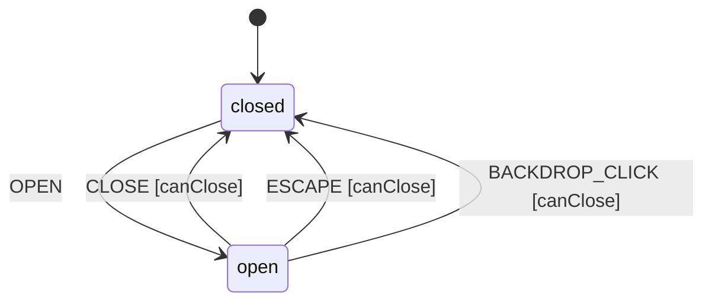

# Dialog

A Dialog is a modal window that overlays the page content, requiring user interaction before returning to the main application. Supports focus trapping, backdrop click dismissal, and escape key handling.

## Language References

| Language | Purpose | Reference |
|----------|---------|-----------|
| Sudolang | Human intent, requirements, accessibility | `references/sudolang-v2.0.md` |
| Quint | Formal verification, invariants | `references/quint-lang.md` |
| CUE | Runtime config, type constraints | `references/cuelang-v0.15.1.md` |

---

## Requirements

```sudolang
// Dialog provides modal overlay for critical interactions.
// Focus is trapped within the dialog while open.

Users interact via:
  - Trigger button opens dialog
  - Close button dismisses dialog
  - Escape key dismisses dialog
  - Backdrop click may dismiss (configurable)

Constraints:
  - Only one dialog can be open at a time (or stacked)
  - Focus traps within dialog content
  - Scroll is prevented on body when modal
  - Return focus to trigger on close

Keyboard Interaction:
  - Tab/Shift+Tab: Navigate focusable elements (trapped)
  - Escape: Close dialog (if not prevented)

Focus Management:
  - On open: Focus first focusable element or dialog itself
  - On close: Return focus to trigger element
```

---

## Design Guidelines

```sudolang
// Visual Design Guidelines

Appearance:
  - Centered in viewport (or custom position)
  - Semi-transparent backdrop (rgba(0,0,0,0.5))
  - Elevated with box-shadow
  - Rounded corners (8-12px)
  - Maximum width constrained (usually 500px)

Animation:
  - Open: Fade backdrop 200ms, scale dialog 0.95→1
  - Close: Fade out 150ms

Variants:
  Modal: Backdrop blocks interaction, focus trapped
  Non-modal: Backdrop optional, no focus trap

Responsive:
  - Full-width on mobile with padding
  - Scrollable content area for long dialogs
```

---

## Component API

```typescript
interface DialogProps {
  /** Whether the dialog is open */
  open?: boolean;  // default: false
  
  /** Called when open state changes */
  onOpenChange?: (open: boolean) => void;
  
  /** Dialog content */
  children: Slot;
}
```

## Formal Model

```quint
module dialog {
  // State variables
  var open: bool              // Whether dialog is visible
  var preventClose: bool      // Whether close is prevented
  var state: str              // "closed" | "open"
  var _action: str            // Tracks action name for ITF traces
  
  // Initialize (closed)
  action init = all {
    open' = false,
    preventClose' = false,
    state' = "closed",
    _action' = "init"
  }
  
  // Open the dialog
  action openDialog = all {
    state == "closed",
    open' = true,
    preventClose' = preventClose,
    state' = "open",
    _action' = "OPEN"
  }
  
  // Close the dialog
  action closeDialog = all {
    state == "open",
    not(preventClose),
    open' = false,
    preventClose' = preventClose,
    state' = "closed",
    _action' = "CLOSE"
  }
  
  // Escape key pressed
  action escape = all {
    state == "open",
    not(preventClose),
    open' = false,
    preventClose' = preventClose,
    state' = "closed",
    _action' = "ESCAPE"
  }
  
  // Backdrop clicked
  action backdropClick = all {
    state == "open",
    not(preventClose),
    open' = false,
    preventClose' = preventClose,
    state' = "closed",
    _action' = "BACKDROP_CLICK"
  }
  
  // Step action for simulation
  action step = any {
    openDialog,
    closeDialog,
    escape,
    backdropClick
  }
  
  // Invariants
  val open_matches_state = (open == true and state == "open") or (open == false and state == "closed")
  val preventClose_is_boolean = preventClose == true or preventClose == false
}
```

---

## Test Vectors

```test-vectors
# Dialog conformance test scenarios

- scenario: "open dialog"
  given:
    context: { open: false, preventClose: false }
    state: "closed"
  when: OPEN
  then:
    context: { open: true, preventClose: false }
    state: "open"

- scenario: "close dialog"
  given:
    context: { open: true, preventClose: false }
    state: "open"
  when: CLOSE
  then:
    context: { open: false, preventClose: false }
    state: "closed"

- scenario: "escape closes dialog"
  given:
    context: { open: true, preventClose: false }
    state: "open"
  when: ESCAPE
  then:
    context: { open: false, preventClose: false }
    state: "closed"

- scenario: "backdrop click closes dialog"
  given:
    context: { open: true, preventClose: false }
    state: "open"
  when: BACKDROP_CLICK
  then:
    context: { open: false, preventClose: false }
    state: "closed"

- scenario: "preventClose blocks escape"
  given:
    context: { open: true, preventClose: true }
    state: "open"
  when: ESCAPE
  then:
    context: { open: true, preventClose: true }
    state: "open"

- scenario: "preventClose blocks backdrop click"
  given:
    context: { open: true, preventClose: true }
    state: "open"
  when: BACKDROP_CLICK
  then:
    context: { open: true, preventClose: true }
    state: "open"
```

---

## Context Schema

```cue
context: {
    open:              false   // Whether dialog is visible
    preventClose:      false   // Whether dismissal is blocked
    closeOnEscape:     true    // Whether Escape key closes dialog
    closeOnBackdrop:   true    // Whether backdrop click closes dialog
    preventScroll:     true    // Whether body scroll is prevented
}
```

---

## State Machine

```cue
machine: {
    id:      "dialog"
    initial: "closed"
    
    states: {
        closed: {
            on: {
                OPEN: {target: "open", actions: ["setOpen"]}
            }
        }
        open: {
            on: {
                CLOSE:          {target: "closed", actions: ["setClosed"], guard: "canClose"}
                ESCAPE:         {target: "closed", actions: ["setClosed"], guard: "canClose"}
                BACKDROP_CLICK: {target: "closed", actions: ["setClosed"], guard: "canClose"}
            }
        }
    }
}
```

---

## Guards

```cue
guards: {
    canClose: "!context.preventClose"
}
```

---

## Actions

```cue
actions: {
    setOpen: {
        description: "Open the dialog and trap focus"
        mutation:    "context.open = true"
        emits:       ["onOpenChange"]
    }
    setClosed: {
        description: "Close the dialog and restore focus"
        mutation:    "context.open = false"
        emits:       ["onOpenChange"]
    }
}
```

---

## Accessibility

```sudolang
Role: dialog
ARIA attributes:
  Dialog:
    - role="dialog" or role="alertdialog"
    - aria-modal="true" for modal dialogs
    - aria-labelledby: ID of title element
    - aria-describedby: ID of description (optional)
  Backdrop:
    - aria-hidden="true"

Focus Management:
  - On open: Focus first focusable element
  - Tab traps within dialog content
  - On close: Return focus to trigger

Screen Reader:
  - Announce dialog title on open
  - Alert dialogs should use role="alertdialog"
```

---

## State Diagram


