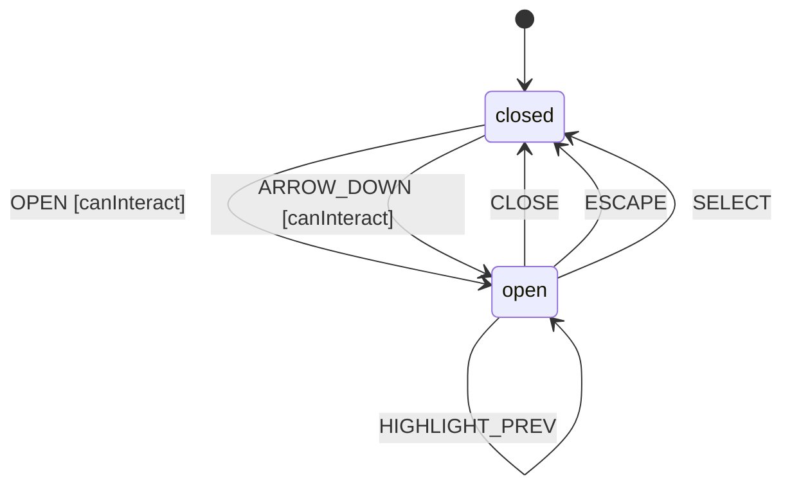

# Select

A Select provides a dropdown menu for choosing a single option from a list. Supports keyboard navigation, typeahead search, and custom option rendering.

## Language References

| Language | Purpose | Reference |
|----------|---------|-----------|
| Sudolang | Human intent, requirements, accessibility | `references/sudolang-v2.0.md` |
| Quint | Formal verification, invariants | `references/quint-lang.md` |
| CUE | Runtime config, type constraints | `references/cuelang-v0.15.1.md` |

---

## Requirements

```sudolang
// Select provides single-value selection from a list.
// Supports both mouse and keyboard interaction.

Users interact via:
  - Click trigger to open dropdown
  - Click option to select
  - Arrow keys to navigate options
  - Enter to confirm selection
  - Escape to cancel
  - Type characters for typeahead search

Constraints:
  - One option selected at a time
  - Disabled options cannot be selected
  - Disabled select blocks all interaction
  - Highlighted option tracks navigation

Keyboard Interaction:
  - Space/Enter: Open dropdown (when closed) or select highlighted
  - ArrowDown: Open dropdown or highlight next option
  - ArrowUp: Highlight previous option
  - Home: Highlight first option
  - End: Highlight last option
  - Escape: Close without selecting
  - Type characters: Jump to matching option (typeahead)
```

---

## Design Guidelines

```sudolang
// Visual Design Guidelines

Trigger:
  - Displays current selection or placeholder
  - Chevron indicator for dropdown
  - Clear visual focus state

Dropdown:
  - Positioned below trigger (or above if constrained)
  - Maximum height with scroll for long lists
  - Subtle box-shadow and border

Options:
  - Clear hover/highlight states
  - Checkmark or visual indicator for selected
  - Disabled options visually muted

Animation:
  - Open: Fade + slide from top, 150ms
  - Close: Fade out, 100ms
```

---

## Component API

```typescript
interface SelectProps {
  /** Currently selected value */
  value?: string;
  
  /** Prevents interaction when true */
  disabled?: boolean;  // default: false
  
  /** Placeholder when no value selected */
  placeholder?: string;
  
  /** Called when value changes */
  onValueChange?: (value: string) => void;
  
  /** Select options */
  children: Slot;
}
```

## Formal Model

```quint
module select {
  // State variables
  var selectedValue: str    // Currently selected option value
  var highlightedValue: str // Currently highlighted option value
  var open: bool            // Whether dropdown is open
  var disabled: bool        // Whether select is disabled
  var state: str            // "closed" | "open"
  var _action: str          // Tracks action name for ITF traces
  
  // Initialize (closed, first option selected)
  action init = all {
    selectedValue' = "option-0",
    highlightedValue' = "option-0",
    open' = false,
    disabled' = false,
    state' = "closed",
    _action' = "init"
  }
  
  // Open the dropdown
  action openDropdown = all {
    not(disabled),
    state == "closed",
    open' = true,
    selectedValue' = selectedValue,
    highlightedValue' = selectedValue,
    disabled' = disabled,
    state' = "open",
    _action' = "OPEN"
  }
  
  // Close the dropdown
  action closeDropdown = all {
    state == "open",
    open' = false,
    selectedValue' = selectedValue,
    highlightedValue' = highlightedValue,
    disabled' = disabled,
    state' = "closed",
    _action' = "CLOSE"
  }
  
  // Highlight next option
  action highlightNext = all {
    state == "open",
    highlightedValue' = if (highlightedValue == "option-0") "option-1" else "option-2",
    open' = open,
    selectedValue' = selectedValue,
    disabled' = disabled,
    state' = state,
    _action' = "HIGHLIGHT_NEXT"
  }
  
  // Highlight previous option
  action highlightPrev = all {
    state == "open",
    highlightedValue' = if (highlightedValue == "option-2") "option-1" else "option-0",
    open' = open,
    selectedValue' = selectedValue,
    disabled' = disabled,
    state' = state,
    _action' = "HIGHLIGHT_PREV"
  }
  
  // Select highlighted option
  action selectHighlighted = all {
    state == "open",
    selectedValue' = highlightedValue,
    highlightedValue' = highlightedValue,
    open' = false,
    disabled' = disabled,
    state' = "closed",
    _action' = "SELECT"
  }
  
  // Highlight first option
  action highlightFirst = all {
    state == "open",
    highlightedValue' = "option-0",
    open' = open,
    selectedValue' = selectedValue,
    disabled' = disabled,
    state' = state,
    _action' = "HIGHLIGHT_FIRST"
  }
  
  // Highlight last option
  action highlightLast = all {
    state == "open",
    highlightedValue' = "option-2",
    open' = open,
    selectedValue' = selectedValue,
    disabled' = disabled,
    state' = state,
    _action' = "HIGHLIGHT_LAST"
  }
  
  // Step action for simulation
  action step = any {
    openDropdown,
    closeDropdown,
    highlightNext,
    highlightPrev,
    highlightFirst,
    highlightLast,
    selectHighlighted
  }
  
  // Invariants
  val open_matches_state = (open == true and state == "open") or (open == false and state == "closed")
  val selected_is_valid = selectedValue == "option-0" or selectedValue == "option-1" or selectedValue == "option-2"
}
```

---

## Test Vectors

```test-vectors
# Select conformance test scenarios

- scenario: "open dropdown"
  given:
    context: { selectedValue: "option-0", highlightedValue: "option-0", open: false, disabled: false }
    state: "closed"
  when: OPEN
  then:
    context: { selectedValue: "option-0", highlightedValue: "option-0", open: true, disabled: false }
    state: "open"

- scenario: "close dropdown"
  given:
    context: { selectedValue: "option-0", highlightedValue: "option-1", open: true, disabled: false }
    state: "open"
  when: CLOSE
  then:
    context: { selectedValue: "option-0", highlightedValue: "option-1", open: false, disabled: false }
    state: "closed"

- scenario: "highlight next option"
  given:
    context: { selectedValue: "option-0", highlightedValue: "option-0", open: true, disabled: false }
    state: "open"
  when: HIGHLIGHT_NEXT
  then:
    context: { selectedValue: "option-0", highlightedValue: "option-1", open: true, disabled: false }
    state: "open"

- scenario: "select highlighted option"
  given:
    context: { selectedValue: "option-0", highlightedValue: "option-1", open: true, disabled: false }
    state: "open"
  when: SELECT
  then:
    context: { selectedValue: "option-1", highlightedValue: "option-1", open: false, disabled: false }
    state: "closed"

- scenario: "disabled blocks open"
  given:
    context: { selectedValue: "option-0", highlightedValue: "option-0", open: false, disabled: true }
    state: "closed"
  when: OPEN
  then:
    context: { selectedValue: "option-0", highlightedValue: "option-0", open: false, disabled: true }
    state: "closed"
```

---

## Context Schema

```cue
context: {
    selectedValue:    "option-0"   // Currently selected option value
    highlightedValue: "option-0"   // Currently highlighted option value
    open:             false        // Whether dropdown is open
    disabled:         false        // Whether select is disabled
}
```

---

## State Machine

```cue
machine: {
    id:      "select"
    initial: "closed"
    
    states: {
        closed: {
            on: {
                OPEN:           {target: "open", actions: ["openMenu"], guard: "canInteract"}
                ARROW_DOWN:     {target: "open", actions: ["openMenu"], guard: "canInteract"}
            }
        }
        open: {
            on: {
                CLOSE:          {target: "closed", actions: ["closeMenu"]}
                ESCAPE:         {target: "closed", actions: ["closeMenu"]}
                SELECT:         {target: "closed", actions: ["selectOption"]}
                HIGHLIGHT_NEXT: {target: "open", actions: ["highlightNext"]}
                HIGHLIGHT_PREV: {target: "open", actions: ["highlightPrev"]}
                HIGHLIGHT_FIRST:{target: "open", actions: ["highlightFirst"]}
                HIGHLIGHT_LAST: {target: "open", actions: ["highlightLast"]}
            }
        }
    }
}
```

---

## Guards

```cue
guards: {
    canInteract: "!context.disabled"
}
```

---

## Actions

```cue
actions: {
    openMenu: {
        description: "Open the dropdown and sync highlight to selected"
        mutation:    "context.open = true; context.highlightedValue = context.selectedValue"
        emits:       ["onOpenChange"]
    }
    closeMenu: {
        description: "Close the dropdown"
        mutation:    "context.open = false"
        emits:       ["onOpenChange"]
    }
    selectOption: {
        description: "Select the highlighted option and close"
        mutation:    "context.selectedValue = context.highlightedValue; context.open = false"
        emits:       ["onValueChange", "onOpenChange"]
    }
    highlightNext: {
        description: "Highlight the next option in the list"
        mutation:    "context.highlightedValue = nextOption(context.highlightedValue)"
    }
    highlightPrev: {
        description: "Highlight the previous option in the list"
        mutation:    "context.highlightedValue = prevOption(context.highlightedValue)"
    }
    highlightFirst: {
        description: "Highlight the first option"
        mutation:    "context.highlightedValue = 'option-0'"
    }
    highlightLast: {
        description: "Highlight the last option"
        mutation:    "context.highlightedValue = 'option-2'"
    }
}
```

---

## Accessibility

```sudolang
Role: combobox (trigger), listbox (dropdown), option (items)
ARIA attributes:
  Trigger:
    - role="combobox"
    - aria-haspopup="listbox"
    - aria-expanded: reflects open state
    - aria-controls: ID of listbox
    - aria-activedescendant: ID of highlighted option
  Listbox:
    - role="listbox"
    - aria-labelledby: ID of label
  Options:
    - role="option"
    - aria-selected: true for selected option
    - aria-disabled: for disabled options

Focus Management:
  - Trigger is focusable
  - Arrow keys move highlight (not focus)
  - Focus stays on trigger when open

Screen Reader:
  - Announce selected value
  - Announce highlighted option on navigation
  - Announce "n of m" position
```

---

## ARIA Mapping

```aria-mapping
| State  | aria-expanded | aria-disabled |
|--------|---------------|---------------|
| closed | false         | {disabled}    |
| open   | true          | {disabled}    |
```

## State Diagram



---

## Example Usages

```tsx example="basic"
<Select.Root onValueChange={(v) => console.log(v)}>
  <Select.Trigger placeholder="Select a fruit..." />
  <Select.Content>
    <Select.Item value="apple">Apple</Select.Item>
    <Select.Item value="banana">Banana</Select.Item>
    <Select.Item value="cherry">Cherry</Select.Item>
  </Select.Content>
</Select.Root>
```

```tsx example="withDefault"
<Select.Root defaultValue="banana">
  <Select.Trigger />
  <Select.Content>
    <Select.Item value="apple">Apple</Select.Item>
    <Select.Item value="banana">Banana</Select.Item>
  </Select.Content>
</Select.Root>
```
