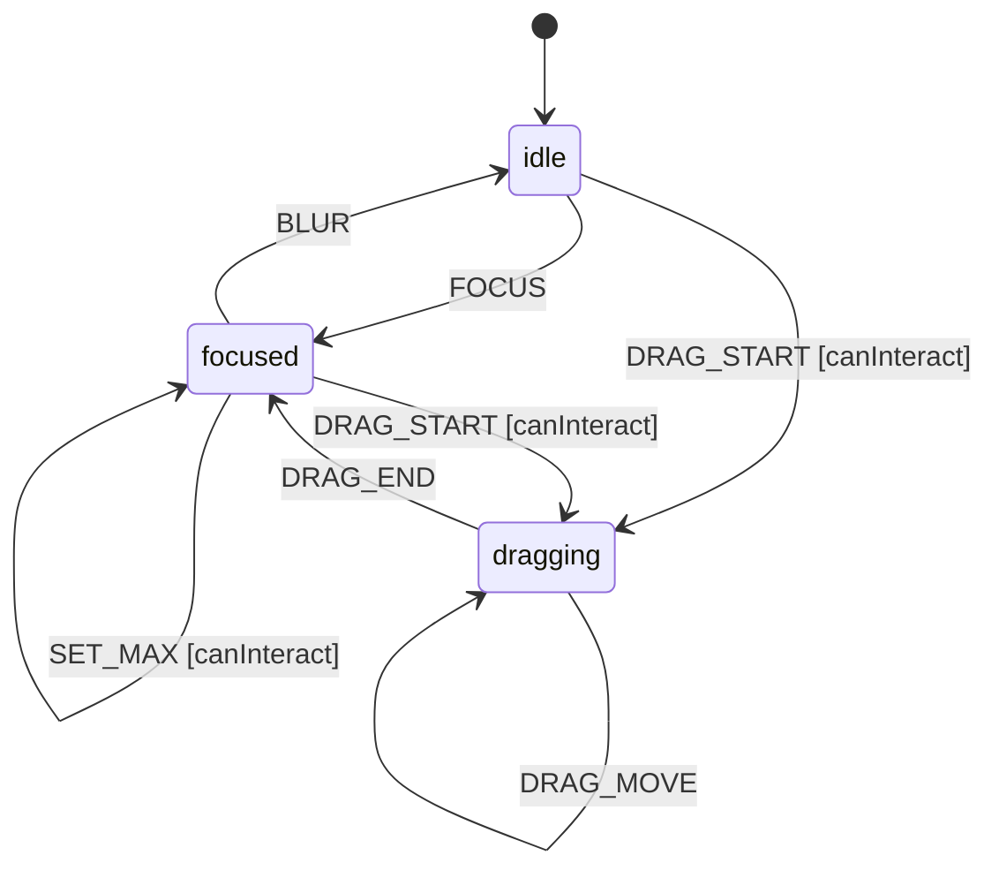

# Slider

A Slider allows users to select a numeric value within a range by dragging a thumb or using keyboard controls. Supports min/max bounds, step increments, and orientation.

## Language References

| Language | Purpose | Reference |
|----------|---------|-----------|
| Sudolang | Human intent, requirements, accessibility | `references/sudolang-v2.0.md` |
| Quint | Formal verification, invariants | `references/quint-lang.md` |
| CUE | Runtime config, type constraints | `references/cuelang-v0.15.1.md` |

---

## Requirements

```sudolang
// Slider provides continuous or stepped value selection.
// Supports mouse drag and keyboard control.

Users interact via:
  - Click on track to jump to value
  - Drag thumb to adjust value
  - Arrow keys to increment/decrement
  - Page Up/Down for larger steps

Constraints:
  - Value clamped to min/max range
  - Step size determines increment granularity
  - Disabled state blocks all interaction
  - Focus visible on thumb element

Keyboard Interaction:
  - ArrowRight/ArrowUp: Increment by step
  - ArrowLeft/ArrowDown: Decrement by step
  - PageUp: Increment by large step (10x)
  - PageDown: Decrement by large step (10x)
  - Home: Set to minimum value
  - End: Set to maximum value
```

---

## Design Guidelines

```sudolang
// Visual Design Guidelines

Track:
  - Full width of container
  - Subtle background color
  - Filled portion shows value visually

Thumb:
  - Circular or rounded thumb (16-20px)
  - Clear focus state (ring or shadow)
  - Positioned at current value

States:
  - Idle: Default appearance
  - Hover: Thumb scales slightly
  - Dragging: Thumb elevated, cursor grabbing
  - Focused: Focus ring visible
  - Disabled: 50% opacity, no interaction

Orientation:
  - Horizontal (default): left=min, right=max
  - Vertical: bottom=min, top=max
```

---

## Formal Model

```quint
module slider {
  // State variables
  var value: int          // Current value (0-100 for simplicity)
  var min: int            // Minimum value
  var max: int            // Maximum value
  var stepSize: int       // Step increment
  var disabled: bool      // Whether interaction is blocked
  var dragging: bool      // Whether currently dragging
  var state: str          // "idle" | "focused" | "dragging"
  var _action: str        // Tracks action name for ITF traces
  
  // Initialize
  action init = all {
    value' = 50,
    min' = 0,
    max' = 100,
    stepSize' = 1,
    disabled' = false,
    dragging' = false,
    state' = "idle",
    _action' = "init"
  }
  
  // Focus the slider
  action focus = all {
    state == "idle",
    state' = "focused",
    value' = value,
    min' = min,
    max' = max,
    stepSize' = stepSize,
    disabled' = disabled,
    dragging' = false,
    _action' = "FOCUS"
  }
  
  // Blur the slider
  action blur = all {
    state == "focused",
    state' = "idle",
    value' = value,
    min' = min,
    max' = max,
    stepSize' = stepSize,
    disabled' = disabled,
    dragging' = false,
    _action' = "BLUR"
  }
  
  // Increment value by step
  action increment = all {
    not(disabled),
    state == "focused",
    value' = if (value + stepSize <= max) value + stepSize else max,
    min' = min,
    max' = max,
    stepSize' = stepSize,
    disabled' = disabled,
    dragging' = dragging,
    state' = state,
    _action' = "INCREMENT"
  }
  
  // Decrement value by step
  action decrement = all {
    not(disabled),
    state == "focused",
    value' = if (value - stepSize >= min) value - stepSize else min,
    min' = min,
    max' = max,
    stepSize' = stepSize,
    disabled' = disabled,
    dragging' = dragging,
    state' = state,
    _action' = "DECREMENT"
  }
  
  // Set to minimum
  action setMin = all {
    not(disabled),
    state == "focused",
    value' = min,
    min' = min,
    max' = max,
    stepSize' = stepSize,
    disabled' = disabled,
    dragging' = dragging,
    state' = state,
    _action' = "SET_MIN"
  }
  
  // Set to maximum
  action setMax = all {
    not(disabled),
    state == "focused",
    value' = max,
    min' = min,
    max' = max,
    stepSize' = stepSize,
    disabled' = disabled,
    dragging' = dragging,
    state' = state,
    _action' = "SET_MAX"
  }
  
  // Start dragging
  action dragStart = all {
    not(disabled),
    dragging' = true,
    state' = "dragging",
    value' = value,
    min' = min,
    max' = max,
    stepSize' = stepSize,
    disabled' = disabled,
    _action' = "DRAG_START"
  }
  
  // End dragging
  action dragEnd = all {
    dragging,
    dragging' = false,
    state' = "focused",
    value' = value,
    min' = min,
    max' = max,
    stepSize' = stepSize,
    disabled' = disabled,
    _action' = "DRAG_END"
  }
  
  // Step action for simulation
  action step = any {
    focus,
    blur,
    increment,
    decrement,
    setMin,
    setMax,
    dragStart,
    dragEnd
  }
  
  // Invariants
  val value_in_range = value >= min and value <= max
  val dragging_implies_state = dragging implies state == "dragging"
}
```

---

## Test Vectors

```test-vectors
# Slider conformance test scenarios

- scenario: "focus slider"
  given:
    context: { value: 50, min: 0, max: 100, step: 1, disabled: false, dragging: false }
    state: "idle"
  when: FOCUS
  then:
    context: { value: 50, min: 0, max: 100, step: 1, disabled: false, dragging: false }
    state: "focused"

- scenario: "increment value"
  given:
    context: { value: 50, min: 0, max: 100, step: 1, disabled: false, dragging: false }
    state: "focused"
  when: INCREMENT
  then:
    context: { value: 51, min: 0, max: 100, step: 1, disabled: false, dragging: false }
    state: "focused"

- scenario: "decrement value"
  given:
    context: { value: 50, min: 0, max: 100, step: 1, disabled: false, dragging: false }
    state: "focused"
  when: DECREMENT
  then:
    context: { value: 49, min: 0, max: 100, step: 1, disabled: false, dragging: false }
    state: "focused"

- scenario: "clamp at maximum"
  given:
    context: { value: 100, min: 0, max: 100, step: 1, disabled: false, dragging: false }
    state: "focused"
  when: INCREMENT
  then:
    context: { value: 100, min: 0, max: 100, step: 1, disabled: false, dragging: false }
    state: "focused"

- scenario: "clamp at minimum"
  given:
    context: { value: 0, min: 0, max: 100, step: 1, disabled: false, dragging: false }
    state: "focused"
  when: DECREMENT
  then:
    context: { value: 0, min: 0, max: 100, step: 1, disabled: false, dragging: false }
    state: "focused"

- scenario: "set to minimum"
  given:
    context: { value: 50, min: 0, max: 100, step: 1, disabled: false, dragging: false }
    state: "focused"
  when: SET_MIN
  then:
    context: { value: 0, min: 0, max: 100, step: 1, disabled: false, dragging: false }
    state: "focused"

- scenario: "disabled blocks increment"
  given:
    context: { value: 50, min: 0, max: 100, step: 1, disabled: true, dragging: false }
    state: "focused"
  when: INCREMENT
  then:
    context: { value: 50, min: 0, max: 100, step: 1, disabled: true, dragging: false }
    state: "focused"
```

---

## Context Schema

```cue
context: {
    value:    50      // Current slider value
    min:      0       // Minimum value
    max:      100     // Maximum value
    step:     1       // Step increment
    disabled: false   // Whether interaction is blocked
    dragging: false   // Whether currently dragging
}
```

---

## State Machine

```cue
machine: {
    id:      "slider"
    initial: "idle"
    
    states: {
        idle: {
            on: {
                FOCUS:      {target: "focused", actions: []}
                DRAG_START: {target: "dragging", actions: ["startDrag"], guard: "canInteract"}
            }
        }
        focused: {
            on: {
                BLUR:       {target: "idle", actions: []}
                INCREMENT:  {target: "focused", actions: ["incrementValue"], guard: "canInteract"}
                DECREMENT:  {target: "focused", actions: ["decrementValue"], guard: "canInteract"}
                SET_MIN:    {target: "focused", actions: ["setToMin"], guard: "canInteract"}
                SET_MAX:    {target: "focused", actions: ["setToMax"], guard: "canInteract"}
                DRAG_START: {target: "dragging", actions: ["startDrag"], guard: "canInteract"}
            }
        }
        dragging: {
            on: {
                DRAG_END:   {target: "focused", actions: ["endDrag"]}
            }
        }
    }
}
```

---

## Guards

```cue
guards: {
    canInteract: "!context.disabled"
}
```

---

## Actions

```cue
actions: {
    incrementValue: {
        description: "Increase value by step, clamped to max"
        mutation:    "context.value = Math.min(context.value + context.step, context.max)"
        emits:       ["onValueChange"]
    }
    decrementValue: {
        description: "Decrease value by step, clamped to min"
        mutation:    "context.value = Math.max(context.value - context.step, context.min)"
        emits:       ["onValueChange"]
    }
    setToMin: {
        description: "Set value to minimum"
        mutation:    "context.value = context.min"
        emits:       ["onValueChange"]
    }
    setToMax: {
        description: "Set value to maximum"
        mutation:    "context.value = context.max"
        emits:       ["onValueChange"]
    }
    startDrag: {
        description: "Begin drag interaction"
        mutation:    "context.dragging = true"
        emits:       ["onDragStart"]
    }
    endDrag: {
        description: "End drag interaction"
        mutation:    "context.dragging = false"
        emits:       ["onDragEnd", "onValueCommit"]
    }
    updateValue: {
        description: "Update value during drag"
        mutation:    "context.value = clamp(event.payload.value, context.min, context.max)"
        emits:       ["onValueChange"]
    }
}
```

---

## Accessibility

```sudolang
Role: slider
ARIA attributes:
  Thumb:
    - role="slider"
    - aria-valuenow: current value
    - aria-valuemin: minimum value
    - aria-valuemax: maximum value
    - aria-valuetext: human-readable value (optional)
    - aria-orientation: "horizontal" or "vertical"
    - aria-disabled: reflects disabled state

Focus Management:
  - Thumb element is focusable
  - Arrow keys adjust value

Screen Reader:
  - Announce value changes
  - Announce min/max on focus
```

---

## State Diagram


