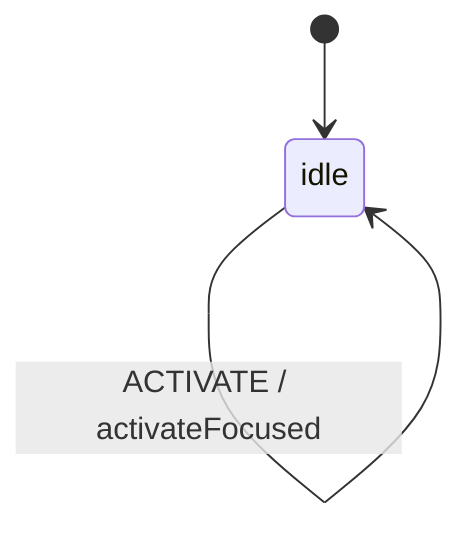

# Tabs

A tabs component organizes content into multiple panels, allowing users to switch
between them. Only one panel is visible at a time.

## Language References

| Language | Purpose | Reference |
|----------|---------|-----------| 
| Sudolang | Human intent, requirements, accessibility | `references/sudolang-v2.0.md` |
| Quint | Formal verification, invariants | `references/quint-lang.md` |
| CUE | Runtime config, type constraints | `references/cuelang-v0.15.1.md` |

---

## Requirements

```sudolang
// Tabs Component Requirements

A tabbed interface enables switching between content panels.
Only one tab is active and one panel visible at a time.

States:
  - idle: Default state, tracks which tab is active
  
Constraints:
  - Exactly one tab is active at any time
  - Active tab has aria-selected="true"
  - Only the active panel is visible
  - Disabled tabs cannot be activated

Keyboard Interaction:
  - Tab: Enter/exit tablist, focus active tab
  - Left/Right Arrow: Move focus between tabs
  - Home: Focus first tab
  - End: Focus last tab
  - Enter/Space: Activate focused tab (if not auto-activated)

Focus Management:
  - Roving tabindex: only active tab in tab sequence
  - Arrow keys move focus and optionally activate
```

---

## Design Guidelines

```sudolang
// Visual Design Guidelines

Layout:
  Horizontal tabs (default) or vertical orientation
  
Visual States:
  Default: Base tab appearance
  Hover: Subtle highlight
  Focused: Visible focus ring
  Active: Strong visual indicator (border, background)
  Disabled: Reduced opacity

Transitions:
  Tab activation: 150ms ease-out
  Panel switch: Optional crossfade or instant
```

---

## Formal Model

```quint
module tabs {
  // State variables - string for selected tab ID
  var selectedId: str
  var focusedId: str
  var state: str  // always "idle" - matches CUE state machine
  var _action: str  // Tracks action name for ITF traces
  
  // Initialize (first tab selected)
  action init = all {
    selectedId' = "tab-0",
    focusedId' = "tab-0",
    state' = "idle",
    _action' = "init"
  }
  
  // Select a specific tab
  action selectTab0 = all {
    selectedId' = "tab-0",
    focusedId' = "tab-0",
    state' = "idle",
    _action' = "SELECT_TAB"
  }
  
  action selectTab1 = all {
    selectedId' = "tab-1",
    focusedId' = "tab-1",
    state' = "idle",
    _action' = "SELECT_TAB"
  }
  
  // Focus without selecting
  action focusNext = all {
    focusedId' = "tab-1",
    selectedId' = selectedId,
    state' = "idle",
    _action' = "FOCUS_NEXT"
  }
  
  action focusPrev = all {
    focusedId' = "tab-0",
    selectedId' = selectedId,
    state' = "idle",
    _action' = "FOCUS_PREV"
  }
  
  // Activate focused tab
  action activate = all {
    selectedId' = focusedId,
    focusedId' = focusedId,
    state' = "idle",
    _action' = "ACTIVATE"
  }
  
  // Step action for simulation (excludes init - that's for initialization only)
  action step = any {
    selectTab0,
    selectTab1,
    focusNext,
    focusPrev,
    activate
  }
  
  // Invariants
  val selected_is_valid = selectedId == "tab-0" or selectedId == "tab-1"
  val focused_is_valid = focusedId == "tab-0" or focusedId == "tab-1"
  val state_is_idle = state == "idle"
}
```

---

## Test Vectors

```test-vectors
# Tabs conformance test scenarios

- scenario: "select tab with payload (same tab)"
  given:
    context: { selectedId: "tab-0", focusedId: "tab-0" }
    state: "idle"
  when: SELECT_TAB
  payload: { id: "tab-0" }
  then:
    context: { selectedId: "tab-0", focusedId: "tab-0" }
    state: "idle"

- scenario: "select tab with payload (different tab)"
  given:
    context: { selectedId: "tab-0", focusedId: "tab-0" }
    state: "idle"
  when: SELECT_TAB
  payload: { id: "tab-1" }
  then:
    context: { selectedId: "tab-1", focusedId: "tab-1" }
    state: "idle"

- scenario: "focus next tab"
  given:
    context: { selectedId: "tab-0", focusedId: "tab-0" }
    state: "idle"
  when: FOCUS_NEXT
  then:
    context: { selectedId: "tab-0", focusedId: "tab-1" }
    state: "idle"

- scenario: "focus previous tab"
  given:
    context: { selectedId: "tab-1", focusedId: "tab-1" }
    state: "idle"
  when: FOCUS_PREV
  then:
    context: { selectedId: "tab-1", focusedId: "tab-0" }
    state: "idle"

- scenario: "activate focused tab"
  given:
    context: { selectedId: "tab-0", focusedId: "tab-1" }
    state: "idle"
  when: ACTIVATE
  then:
    context: { selectedId: "tab-1", focusedId: "tab-1" }
    state: "idle"

- scenario: "focus first tab"
  given:
    context: { selectedId: "tab-1", focusedId: "tab-1" }
    state: "idle"
  when: FOCUS_FIRST
  then:
    context: { selectedId: "tab-1", focusedId: "tab-0" }
    state: "idle"

- scenario: "focus last tab"
  given:
    context: { selectedId: "tab-0", focusedId: "tab-0" }
    state: "idle"
  when: FOCUS_LAST
  then:
    context: { selectedId: "tab-0", focusedId: "tab-1" }
    state: "idle"
```

---

## Context Schema

```cue
context: {
    selectedId: "tab-0"   // ID of the currently selected/active tab
    focusedId:  "tab-0"   // ID of the currently focused tab
}
```

---

## State Machine

```cue
machine: {
    id:      "tabs"
    initial: "idle"
    
    states: {
        idle: {
            on: {
                SELECT_TAB:  {target: "idle", actions: ["setSelected"]}
                FOCUS_NEXT:  {target: "idle", actions: ["focusNextTab"]}
                FOCUS_PREV:  {target: "idle", actions: ["focusPrevTab"]}
                FOCUS_FIRST: {target: "idle", actions: ["focusFirstTab"]}
                FOCUS_LAST:  {target: "idle", actions: ["focusLastTab"]}
                ACTIVATE:    {target: "idle", actions: ["activateFocused"]}
            }
        }
    }
}
```

---

## Guards

```cue
guards: {
    // Tabs has no guards (tab disabled check would be in component logic)
}
```

---

## Actions

```cue
actions: {
    setSelected: {
        description: "Set the selected tab from event payload"
        mutation:    "context.selectedId = event.payload.id; context.focusedId = event.payload.id"
        emits:       ["onTabChange"]
    }
    focusNextTab: {
        description: "Move focus to next tab (wraps)"
        mutation:    "context.focusedId = 'tab-1'"
    }
    focusPrevTab: {
        description: "Move focus to previous tab (wraps)"
        mutation:    "context.focusedId = 'tab-0'"
    }
    focusFirstTab: {
        description: "Focus the first tab"
        mutation:    "context.focusedId = 'tab-0'"
    }
    focusLastTab: {
        description: "Focus the last tab"
        mutation:    "context.focusedId = 'tab-1'"
    }
    activateFocused: {
        description: "Activate the currently focused tab"
        mutation:    "context.selectedId = context.focusedId"
        emits:       ["onTabChange"]
    }
}
```

---

## Accessibility

```sudolang
// Tabs Accessibility Requirements

ARIA Roles:
  tablist: Container for tab buttons (role="tablist")
  tab: Individual tab button (role="tab")
  tabpanel: Content panel (role="tabpanel")

Required Attributes:
  Tab:
    - aria-selected: "true" for active, "false" for inactive
    - aria-controls: ID of associated panel
    - tabindex: 0 for active, -1 for inactive (roving tabindex)
  
  TabPanel:
    - aria-labelledby: ID of controlling tab
    - hidden: (attribute) for inactive panels

Announcements:
  - Tab role and position ("Tab 1 of 3")
  - Selected state ("selected" / "not selected")
```

---

## State Diagram


