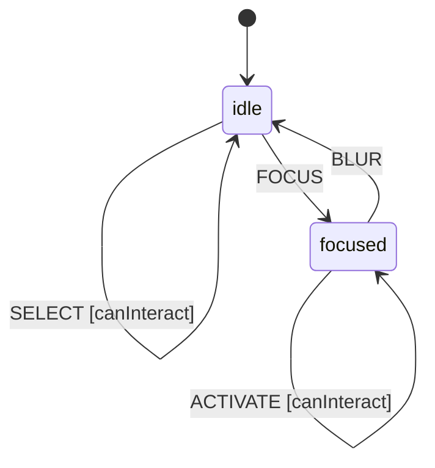

# Toggle Group

A Toggle Group is a set of toggle buttons where only one can be selected at a time (exclusive selection). Used for switching between mutually exclusive options like TS/WASM engine selection.

## Language References

| Language | Purpose | Reference |
|----------|---------|-----------|
| Sudolang | Human intent, requirements, accessibility | `references/sudolang-v2.0.md` |
| Quint | Formal verification, invariants | `references/quint-lang.md` |
| CUE | Runtime config, type constraints | `references/cuelang-v0.15.1.md` |

---

## Requirements

```sudolang
// Toggle Group provides exclusive selection from a set of options.
// Like radio buttons, only one option can be selected at a time.

Users interact via:
  - Click/tap on toggle items
  - Arrow keys for navigation within the group
  - Space/Enter to select focused item

Constraints:
  - Exactly one item is selected at all times (mandatory selection)
  - Selecting a new item deselects the previous
  - Disabled state blocks all user interactions
  - Individual items can be disabled independently

Keyboard Interaction:
  - ArrowLeft/ArrowUp: Focus previous item (wraps)
  - ArrowRight/ArrowDown: Focus next item (wraps)
  - Space/Enter: Select focused item
  - Home: Focus first item
  - End: Focus last item

Error Handling:
  - Attempting to deselect the only item is a no-op
  - Screen readers announce selection changes
```

---

## Design Guidelines

```sudolang
// Visual Design Guidelines

Layout Variants:
  horizontal: Items side-by-side (default)
  vertical: Items stacked

Visual States:
  Unselected: Muted appearance
  Selected: Accent color, visual emphasis
  Focused: Visible focus ring (2px outline)
  Disabled: 50% opacity, not-allowed cursor

Touch Targets:
  Minimum 44x44px for touch accessibility

Transition:
  All state changes: 150ms ease-out

Usage:
  USE for: Mutually exclusive options (view mode, engine selection)
  DO NOT USE for: Multiple selections (use Checkbox Group instead)
```

---

## Formal Model

```quint
module togglegroup {
  // State variables
  var selectedId: str     // Currently selected item ID
  var focusedId: str      // Currently focused item ID
  var disabled: bool      // Whether entire group is disabled
  var state: str          // "idle" | "focused" - matches CUE state machine
  var _action: str        // Tracks action name for ITF traces
  
  // Initialize (first item selected)
  action init = all {
    selectedId' = "item-0",
    focusedId' = "item-0",
    disabled' = false,
    state' = "idle",
    _action' = "init"
  }
  
  // Select item 0
  action selectItem0 = all {
    not(disabled),
    selectedId' = "item-0",
    focusedId' = "item-0",
    disabled' = disabled,
    state' = state,
    _action' = "SELECT"
  }
  
  // Select item 1
  action selectItem1 = all {
    not(disabled),
    selectedId' = "item-1",
    focusedId' = "item-1",
    disabled' = disabled,
    state' = state,
    _action' = "SELECT"
  }
  
  // Focus next item (wraps around)
  action focusNext = all {
    not(disabled),
    focusedId' = if (focusedId == "item-0") "item-1" else "item-0",
    selectedId' = selectedId,
    disabled' = disabled,
    state' = "focused",
    _action' = "FOCUS_NEXT"
  }
  
  // Focus previous item (wraps around)
  action focusPrev = all {
    not(disabled),
    focusedId' = if (focusedId == "item-1") "item-0" else "item-1",
    selectedId' = selectedId,
    disabled' = disabled,
    state' = "focused",
    _action' = "FOCUS_PREV"
  }
  
  // Focus first item
  action focusFirst = all {
    not(disabled),
    focusedId' = "item-0",
    selectedId' = selectedId,
    disabled' = disabled,
    state' = "focused",
    _action' = "FOCUS_FIRST"
  }
  
  // Focus last item
  action focusLast = all {
    not(disabled),
    focusedId' = "item-1",
    selectedId' = selectedId,
    disabled' = disabled,
    state' = "focused",
    _action' = "FOCUS_LAST"
  }
  
  // Activate focused item (Space/Enter)
  action activate = all {
    not(disabled),
    selectedId' = focusedId,
    focusedId' = focusedId,
    disabled' = disabled,
    state' = state,
    _action' = "ACTIVATE"
  }
  
  // Enter focused state
  action focus = all {
    not(disabled),
    state' = "focused",
    selectedId' = selectedId,
    focusedId' = focusedId,
    disabled' = disabled,
    _action' = "FOCUS"
  }
  
  // Leave focused state
  action blur = all {
    state' = "idle",
    selectedId' = selectedId,
    focusedId' = selectedId,  // Reset focus to selected on blur
    disabled' = disabled,
    _action' = "BLUR"
  }
  
  // Step action for simulation
  action step = any {
    selectItem0,
    selectItem1,
    focusNext,
    focusPrev,
    focusFirst,
    focusLast,
    activate,
    focus,
    blur
  }
  
  // Invariants
  val selected_is_valid = selectedId == "item-0" or selectedId == "item-1"
  val focused_is_valid = focusedId == "item-0" or focusedId == "item-1"
  val state_is_valid = state == "idle" or state == "focused"
  val disabled_is_boolean = disabled == true or disabled == false
}
```

---

## Test Vectors

```test-vectors
# Toggle Group conformance test scenarios

- scenario: "select changes value"
  given:
    context: { selectedId: "item-0", focusedId: "item-0", disabled: false }
    state: "idle"
  when: SELECT
  payload: { id: "item-1" }
  then:
    context: { selectedId: "item-1", focusedId: "item-1", disabled: false }
    state: "idle"

- scenario: "disabled blocks selection"
  given:
    context: { selectedId: "item-0", focusedId: "item-0", disabled: true }
    state: "idle"
  when: SELECT
  payload: { id: "item-1" }
  then:
    context: { selectedId: "item-0", focusedId: "item-0", disabled: true }
    state: "idle"

- scenario: "focus next wraps"
  given:
    context: { selectedId: "item-0", focusedId: "item-1", disabled: false }
    state: "focused"
  when: FOCUS_NEXT
  then:
    context: { selectedId: "item-0", focusedId: "item-0", disabled: false }
    state: "focused"

- scenario: "focus previous wraps"
  given:
    context: { selectedId: "item-0", focusedId: "item-0", disabled: false }
    state: "focused"
  when: FOCUS_PREV
  then:
    context: { selectedId: "item-0", focusedId: "item-1", disabled: false }
    state: "focused"

- scenario: "activate selects focused"
  given:
    context: { selectedId: "item-0", focusedId: "item-1", disabled: false }
    state: "focused"
  when: ACTIVATE
  then:
    context: { selectedId: "item-1", focusedId: "item-1", disabled: false }
    state: "focused"

- scenario: "blur resets focus to selected"
  given:
    context: { selectedId: "item-0", focusedId: "item-1", disabled: false }
    state: "focused"
  when: BLUR
  then:
    context: { selectedId: "item-0", focusedId: "item-0", disabled: false }
    state: "idle"
```

---

## Context Schema

```cue
context: {
    selectedId: "item-0"   // ID of currently selected item
    focusedId:  "item-0"   // ID of currently focused item
    disabled:   false      // Whether entire group is disabled
}
```

---

## State Machine

```cue
machine: {
    id:      "toggle-group"
    initial: "idle"
    
    states: {
        idle: {
            on: {
                SELECT:       {target: "idle", actions: ["selectItem"], guard: "canInteract"}
                FOCUS:        {target: "focused", actions: []}
                FOCUS_NEXT:   {target: "focused", actions: ["focusNextItem"], guard: "canInteract"}
                FOCUS_PREV:   {target: "focused", actions: ["focusPrevItem"], guard: "canInteract"}
                FOCUS_FIRST:  {target: "focused", actions: ["focusFirstItem"], guard: "canInteract"}
                FOCUS_LAST:   {target: "focused", actions: ["focusLastItem"], guard: "canInteract"}
                ACTIVATE:     {target: "idle", actions: ["activateItem"], guard: "canInteract"}
            }
        }
        focused: {
            on: {
                SELECT:       {target: "focused", actions: ["selectItem"], guard: "canInteract"}
                FOCUS_NEXT:   {target: "focused", actions: ["focusNextItem"], guard: "canInteract"}
                FOCUS_PREV:   {target: "focused", actions: ["focusPrevItem"], guard: "canInteract"}
                FOCUS_FIRST:  {target: "focused", actions: ["focusFirstItem"], guard: "canInteract"}
                FOCUS_LAST:   {target: "focused", actions: ["focusLastItem"], guard: "canInteract"}
                ACTIVATE:     {target: "focused", actions: ["activateItem"], guard: "canInteract"}
                BLUR:         {target: "idle", actions: ["resetFocus"]}
            }
        }
    }
}
```

---

## Guards

```cue
guards: {
    canInteract: "!context.disabled"
}
```

---

## Actions

```cue
actions: {
    selectItem: {
        description: "Select an item by ID"
        mutation:    "context.selectedId = event.payload.id; context.focusedId = event.payload.id"
        emits:       ["onValueChange"]
    }
    focusNextItem: {
        description: "Focus the next item (wraps)"
        mutation:    "context.focusedId = (context.focusedId == 'item-0') ? 'item-1' : 'item-0'"
    }
    focusPrevItem: {
        description: "Focus the previous item (wraps)"
        mutation:    "context.focusedId = (context.focusedId == 'item-1') ? 'item-0' : 'item-1'"
    }
    focusFirstItem: {
        description: "Focus the first item"
        mutation:    "context.focusedId = 'item-0'"
    }
    focusLastItem: {
        description: "Focus the last item"
        mutation:    "context.focusedId = 'item-1'"
    }
    activateItem: {
        description: "Select the currently focused item"
        mutation:    "context.selectedId = context.focusedId"
        emits:       ["onValueChange"]
    }
    resetFocus: {
        description: "Reset focus to selected item on blur"
        mutation:    "context.focusedId = context.selectedId"
    }
}
```

---

## Accessibility

```sudolang
Role: radiogroup (container), radio (items)
ARIA attributes:
  Container:
    - role="radiogroup"
    - aria-label: descriptive label
    - aria-disabled: reflects context.disabled
  Items:
    - role="radio"
    - aria-checked: true for selected item
    - aria-disabled: true for disabled items
    - tabindex: 0 for selected, -1 for others

Focus Management:
  - Only selected item is in tab order
  - Arrow keys move focus within group
  - Focus wraps at boundaries

Screen Reader:
  - Announce "{label}, radio button, {n} of {total}"
  - Announce "selected" or "not selected"
  - Announce selection changes
```

---

## State Diagram


