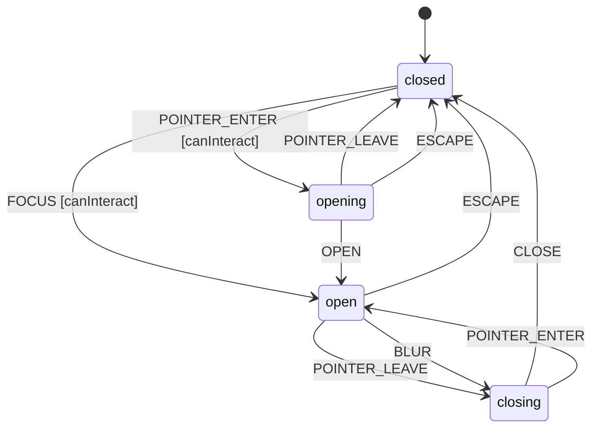

# Tooltip

A Tooltip displays contextual information when users hover over or focus on a trigger element. Supports configurable open/close delays and positioning.

## Language References

| Language | Purpose | Reference |
|----------|---------|-----------|
| Sudolang | Human intent, requirements, accessibility | `references/sudolang-v2.0.md` |
| Quint | Formal verification, invariants | `references/quint-lang.md` |
| CUE | Runtime config, type constraints | `references/cuelang-v0.15.1.md` |

---

## Requirements

```sudolang
// Tooltip provides contextual help on hover or focus.
// Opens after a delay and closes when interaction ends.

Users interact via:
  - Mouse hover over trigger element
  - Keyboard focus on trigger element
  - Escape key to dismiss

Constraints:
  - Open delay prevents accidental activation (default 700ms)
  - Close delay allows moving to tooltip content (default 300ms)
  - Only one tooltip visible at a time (global)
  - Disabled triggers do not show tooltips

Keyboard Interaction:
  - Tab: Focus trigger shows tooltip
  - Escape: Immediately closes tooltip
  - Blur: Close after closeDelay

Positioning:
  - Auto-positions to avoid viewport edges
  - Supports top, right, bottom, left placements
  - Arrow points to trigger element
```

---

## Design Guidelines

```sudolang
// Visual Design Guidelines

Appearance:
  - Dark background with light text (inverted colors)
  - Rounded corners (4-6px radius)
  - Subtle box-shadow for depth
  - Maximum width 250px, text wraps

Animation:
  - Fade in: 150ms ease-out
  - Fade out: 100ms ease-in
  - Scale from 0.95 to 1 on open

Positioning:
  - 8px offset from trigger
  - Arrow indicator pointing to trigger
  - Flip to opposite side if constrained

Timing:
  - openDelay: 700ms (prevents accidental triggers)
  - closeDelay: 300ms (allows moving to tooltip)
  - Interactive tooltips: longer closeDelay (500ms)
```

---

## Component API

```typescript
interface TooltipProps {
  /** Tooltip content */
  content: string | Slot;
  
  /** Delay before showing (ms) */
  delayDuration?: number;  // default: 300
  
  /** Trigger element */
  children: Slot;
}
```

## Formal Model

```quint
module tooltip {
  // State variables
  var open: bool          // Whether tooltip is visible
  var disabled: bool      // Whether tooltip is disabled
  var state: str          // "closed" | "opening" | "open" | "closing"
  var _action: str        // Tracks action name for ITF traces
  
  // Initialize (closed)
  action init = all {
    open' = false,
    disabled' = false,
    state' = "closed",
    _action' = "init"
  }
  
  // Pointer enters trigger
  action pointerEnter = all {
    not(disabled),
    state == "closed",
    open' = false,
    disabled' = disabled,
    state' = "opening",
    _action' = "POINTER_ENTER"
  }
  
  // Open delay completes
  action openComplete = all {
    state == "opening",
    open' = true,
    disabled' = disabled,
    state' = "open",
    _action' = "OPEN"
  }
  
  // Pointer leaves trigger
  action pointerLeave = all {
    not(disabled),
    state == "open" or state == "opening",
    open' = if (state == "open") open else false,
    disabled' = disabled,
    state' = if (state == "open") "closing" else "closed",
    _action' = "POINTER_LEAVE"
  }
  
  // Close delay completes
  action closeComplete = all {
    state == "closing",
    open' = false,
    disabled' = disabled,
    state' = "closed",
    _action' = "CLOSE"
  }
  
  // Focus trigger
  action focus = all {
    not(disabled),
    state == "closed",
    open' = true,
    disabled' = disabled,
    state' = "open",
    _action' = "FOCUS"
  }
  
  // Blur trigger
  action blur = all {
    state == "open",
    open' = false,
    disabled' = disabled,
    state' = "closing",
    _action' = "BLUR"
  }
  
  // Escape key dismisses immediately
  action escape = all {
    state == "open" or state == "opening",
    open' = false,
    disabled' = disabled,
    state' = "closed",
    _action' = "ESCAPE"
  }
  
  // Step action for simulation
  action step = any {
    pointerEnter,
    openComplete,
    pointerLeave,
    closeComplete,
    focus,
    blur,
    escape
  }
  
  // Invariants
  val open_implies_open_state = open implies state == "open"
  val disabled_is_boolean = disabled == true or disabled == false
}
```

---

## Test Vectors

```test-vectors
# Tooltip conformance test scenarios

- scenario: "pointer enter starts opening"
  given:
    context: { open: false, disabled: false }
    state: "closed"
  when: POINTER_ENTER
  then:
    context: { open: false, disabled: false }
    state: "opening"

- scenario: "open completes after delay"
  given:
    context: { open: false, disabled: false }
    state: "opening"
  when: OPEN
  then:
    context: { open: true, disabled: false }
    state: "open"

- scenario: "pointer leave starts closing"
  given:
    context: { open: true, disabled: false }
    state: "open"
  when: POINTER_LEAVE
  then:
    context: { open: true, disabled: false }
    state: "closing"

- scenario: "close completes after delay"
  given:
    context: { open: true, disabled: false }
    state: "closing"
  when: CLOSE
  then:
    context: { open: false, disabled: false }
    state: "closed"

- scenario: "escape dismisses immediately"
  given:
    context: { open: true, disabled: false }
    state: "open"
  when: ESCAPE
  then:
    context: { open: false, disabled: false }
    state: "closed"

- scenario: "focus opens immediately"
  given:
    context: { open: false, disabled: false }
    state: "closed"
  when: FOCUS
  then:
    context: { open: true, disabled: false }
    state: "open"

- scenario: "disabled blocks pointer enter"
  given:
    context: { open: false, disabled: true }
    state: "closed"
  when: POINTER_ENTER
  then:
    context: { open: false, disabled: true }
    state: "closed"
```

---

## Context Schema

```cue
context: {
    open:       false   // Whether tooltip is visible
    disabled:   false   // Whether tooltip is disabled
    openDelay:  700     // Delay before opening (ms)
    closeDelay: 300     // Delay before closing (ms)
}
```

---

## State Machine

```cue
machine: {
    id:      "tooltip"
    initial: "closed"
    
    states: {
        closed: {
            on: {
                POINTER_ENTER: {target: "opening", actions: [], guard: "canInteract"}
                FOCUS:         {target: "open", actions: ["setOpen"], guard: "canInteract"}
            }
        }
        opening: {
            on: {
                OPEN:          {target: "open", actions: ["setOpen"]}
                POINTER_LEAVE: {target: "closed", actions: []}
                ESCAPE:        {target: "closed", actions: []}
            }
        }
        open: {
            on: {
                POINTER_LEAVE: {target: "closing", actions: []}
                BLUR:          {target: "closing", actions: []}
                ESCAPE:        {target: "closed", actions: ["setClosed"]}
            }
        }
        closing: {
            on: {
                CLOSE:         {target: "closed", actions: ["setClosed"]}
                POINTER_ENTER: {target: "open", actions: []}
            }
        }
    }
}
```

---

## Guards

```cue
guards: {
    canInteract: "!context.disabled"
}
```

---

## Actions

```cue
actions: {
    setOpen: {
        description: "Show the tooltip"
        mutation:    "context.open = true"
        emits:       ["onOpenChange"]
    }
    setClosed: {
        description: "Hide the tooltip"
        mutation:    "context.open = false"
        emits:       ["onOpenChange"]
    }
}
```

---

## Accessibility

```sudolang
Role: tooltip
ARIA attributes:
  Trigger:
    - aria-describedby: ID of tooltip content
  Tooltip:
    - role="tooltip"
    - id: unique identifier for aria-describedby reference

Focus Management:
  - Trigger is focusable
  - Tooltip content is not in tab order (informational only)

Screen Reader:
  - Tooltip content announced when trigger focused
  - Use aria-describedby for supplementary information
```

---

## State Diagram


